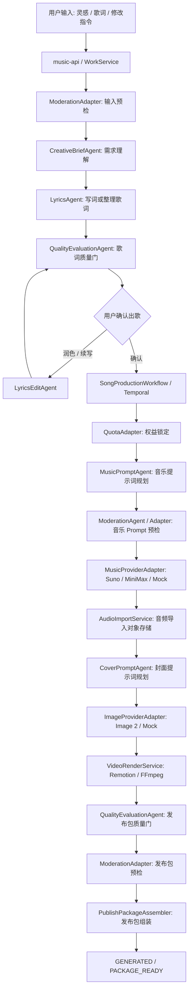

# AI Agent Architecture Direction v0.1

更新时间：2026-06-06

## 1. 标题与元数据

- 标题：燕云 AI 作曲平台 Agent 架构方向基线
- 作者：Codex
- 状态：已决策，作为后续真实模型接入与 Agent 实现方向
- 适用范围：用户需求理解、写词/润色/续写、音乐提示词、Suno / MiniMax 音乐生成、Image 2 封面生成、质量评估、审核预检、MP4 成片和发布包交接
- 关联文档：
  - `docs/specs/ai-agent-orchestration-engineering-design-v0.1.md`
  - `docs/specs/ai-multi-agent-creative-pipeline-v0.1.md`
  - `docs/specs/agent-runtime-audit-v0.1.md`
  - `docs/specs/creative-brief-agent-v0.1.md`
  - `docs/specs/music-prompt-agent-v0.1.md`
  - `docs/specs/cover-prompt-agent-v0.1.md`
  - `docs/specs/dreammaker-music-provider-v0.1.md`
  - `docs/specs/deepseek-knowledge-lyrics-v0.1.md`

## 2. 设计结论

本项目后续采用“确定性 Workflow + 专业 Agent Worker + Provider Adapter”的 Agent 架构。

这意味着：

- 可以有多个专业 Agent，但它们不是自由聊天式自治 Agent。
- Agent 只负责理解、生成、改写、评分、风险识别和建议动作。
- `SongProductionWorkflow` / Temporal 是确认出歌后的唯一主编排器，负责状态、权益、重试、失败收口、对象存储和发布包。
- Suno / MiniMax、Image 2、对象存储、公司审核、公司发布和公司权益都必须通过 Adapter 或 Service 接入，不能让 LLM 直接调用或决定副作用。
- 普通用户和前端不感知 Agent 内部细节，只消费 OpenAPI v0.1 的 `status`、`generation_stage`、`package_status`、`available_actions` 和 `failure`。

这个方向比“一个 Agent 自己全流程创作”更适合当前项目，因为我们要交付给公司开发接入真实系统，必须保证状态可控、成本可控、失败可复现、审计可追踪、默认测试不调用真实外部模型。

## 3. 为什么不做自由多 Agent

自由多 Agent 的表现可能更像“几个模型互相讨论然后决定下一步”，但它不适合作为本项目主架构。

主要问题：

- 状态冲突：多个 Agent 如果都能推进 `works.status`，权益扣减、发布包状态和重试动作会不一致。
- 成本失控：Agent 互相调用会放大 DeepSeek、Suno、MiniMax、Image 2 的真实调用成本。
- 审计困难：公司交接需要每次模型调用的模型名、模板版本、输入输出 hash、失败码、耗时和重试次数。
- 测试困难：自动化测试必须默认只跑 Mock，不能因为某个 Agent 决策而触发真实 API。
- 回滚困难：音乐生成、生图、对象存储写入、公司发布交接都有外部副作用，不能交给 LLM 自由决定。

因此，本项目只做“编排式多 Agent”：Agent 是被 Workflow / Service 明确调用的专业 Worker，输入输出都是结构化契约。

## 4. 总体架构



## 5. Agent / Adapter 清单

| 名称 | 类型 | 职责 | 当前策略 |
|---|---|---|---|
| `CreativeBriefAgent` | Agent | 理解用户意图、主题、情绪、燕云引用和创作约束 | 已有 Mock 合约，后续接 DeepSeek |
| `LyricsAgent` | Agent | 根据创作简报和知识库生成歌词、标题、摘要、music prompt seed、cover prompt seed | 已有 Mock DeepSeek 边界和审计 |
| `LyricsEditAgent` | Agent | 处理 AI 润色、AI 续写和用户修改指令 | 首期可复用写词服务 operation，后续复杂后再独立 |
| `MusicPromptAgent` | Agent | 把最终歌词和创作信息转换成 Suno / MiniMax 友好的音乐生成参数 | 已有 Mock 合约 |
| `MusicProviderAdapter` | Adapter | 调用 DreamMaker / Suno / MiniMax，提交任务、轮询状态、导入音频前返回供应商结果 | 已有 Mock/Suno/MiniMax 骨架，真实调用硬开关关闭 |
| `CoverPromptAgent` | Agent | 把歌词、主题、音乐情绪和燕云视觉规则转换成封面 visual prompt | 已有 Mock 合约 |
| `ImageProviderAdapter` | Adapter | 调用 Image 2 或 Mock 生图，生成封面并导入对象存储 | 后续补真实硬开关和 runbook |
| `VideoPlanAgent` | Agent | 可选；用于复杂视频分镜、背景和字幕节奏规划 | 暂缓，当前先用确定性 render-worker |
| `QualityEvaluationAgent` | Agent | 评估歌词、音乐、封面、视频和发布包质量，返回 pass/retry/block 建议 | 下一步补 Mock 合约 |
| `ModerationAgent` | Agent | AI 辅助识别文本、prompt、封面、发布包风险 | 下一步补 Mock 合约 |
| `ModerationAdapter` | Adapter | 调用公司审核或 Mock 审核，最终审核口径以公司系统为准 | 已有 Mock 边界，真实接入由公司开发替换 |
| `PublishPackageAssembler` | Service | 组装发布包、写对象存储、签发 URL、刷新 URL、标记交接 | 已有本地/S3-MinIO 边界 |

## 6. 职责边界

### Agent 可以做

- 理解用户输入和创作意图。
- 生成歌词、标题、摘要和提示词。
- 改写、润色、续写文本。
- 输出质量分、风险标签、重试建议和阻断建议。
- 返回结构化结果、模型信息、模板版本、输入输出 hash 和耗时。

### Agent 不可以做

- 直接修改 `works.status`、`generation_stage`、`package_status`。
- 直接扣减、释放或提交权益。
- 直接调用 Suno / MiniMax / Image 2。
- 直接写对象存储、组装最终发布包或签发 URL。
- 直接调用公司发布、分享、推荐流、账号或权益系统。
- 在日志、数据库、测试、文档或 commit 信息里保存真实密钥、JWT、Cookie、完整供应商响应或未脱敏敏感内容。

### Workflow / Service 必须做

- 持有作品状态机。
- 持有权益锁定、释放、扣减口径。
- 持有 idempotency、Outbox、Temporal workflow id 和 job 生命周期。
- 决定重试、失败收口、降级和可执行动作。
- 写入 `agent_runs`、`provider_calls`、`media_assets` 和 `publish_packages`。
- 保证发布包进入 `PACKAGE_READY` 前，音频、封面、视频、timeline、URL TTL 和审核预检均满足验收口径。

## 7. 内部契约原则

所有 Agent 输出必须是结构化对象，不允许让业务代码从一段自然语言里猜字段。

最低契约：

```ts
type AgentRunResult<T> = {
  work_id: string;
  agent_name: string;
  agent_version: string;
  operation: string;
  status: "SUCCEEDED" | "FAILED";
  output?: T;
  quality_score?: number;
  risk_notes: string[];
  recommended_action?: "PASS" | "REWRITE" | "RETRY" | "BLOCK" | "MANUAL_REVIEW";
  trace: {
    model_name: string;
    prompt_template_key?: string;
    prompt_template_version?: number;
    input_hash: string;
    output_hash?: string;
    latency_ms: number;
    token_usage?: {
      input_tokens?: number;
      output_tokens?: number;
    };
  };
  failure?: {
    failure_code: string;
    failure_message: string;
    retryable: boolean;
  };
};
```

实现时 Java record / DTO 可以按模块拆分，但必须保留上述语义。

## 8. 质量门与审核门

后续至少保留以下门：

1. 用户输入预检：创建作品前，过滤明显违规输入。
2. 歌词质量门：歌词确认前，检查主题完整度、重复度、燕云相关性和风险。
3. 音乐 prompt 预检：提交 Suno / MiniMax 前，避免高风险内容进入外部供应商。
4. 音乐结果质量门：检查供应商状态、音频 URL、音频时长和导入结果。
5. 封面 prompt / 封面图预检：生成前和入包前分别检查。
6. 视频质量门：检查 MP4 可播放、16:9、字幕安全区、时长和文件大小。
7. 发布包预检：`PACKAGE_READY` 前调用 `ModerationAdapter.preCheckPublishPackage` 或等价公司审核边界。

本地阶段这些门可以是 Mock，但接口、状态、审计和失败码必须先留好。

## 9. 分阶段推进

### Phase 1：Mock Agent 合约补齐

目标：所有关键 Agent 都有输入输出、Mock、失败码和 `agent_runs` 审计。

已完成：

- `CreativeBriefAgent`
- `LyricsAgent` 审计基础
- `MusicPromptAgent`
- `CoverPromptAgent`

下一步：

- `QualityEvaluationAgent`
- `ModerationAgent`

### Phase 2：DeepSeek 真实受控联调

目标：只打开 DeepSeek，音乐、封面、视频、公司系统继续 Mock。

验收：

- 灵感成歌、填词成歌、润色、续写可受控真实调用。
- 真实调用必须有硬开关、timeout、max attempts、失败码、脱敏日志和回退 Mock 方案。
- `agent_runs` 能记录真实模型名、模板版本、输入输出 hash 和耗时。

### Phase 3：Suno / MiniMax 真实受控联调

目标：`MUSIC_PROVIDER=suno|minimax` 时可按 DreamMaker run/status 协议跑最小真实音频成功路径。

验收：

- `MusicPromptAgent` 输出 provider-specific 参数。
- DreamMaker JWT 鉴权只从环境变量读取密钥。
- 供应商音频成功导入对象存储。
- 失败码能映射到 `MUSIC_GENERATION_FAILED` 和 `RETRY_MUSIC`。

### Phase 4：Image 2 真实受控联调

目标：封面可真实生成、存储、进入发布包。

验收：

- `CoverPromptAgent` 输出 16:9 visual prompt。
- Image 2 调用有硬开关、成本限制、timeout 和失败码。
- 失败可默认封面兜底或进入可读失败状态。

### Phase 5：质量评估、审核和公司 Adapter 交接

目标：发布包交给公司系统前可解释、可阻断、可追踪。

验收：

- `QualityEvaluationAgent` 覆盖歌词、音乐、封面、视频和发布包。
- 公司审核 Adapter 与 AI 预检职责拆清，公司审核结果优先级最高。
- `/internal/integration-readiness` 能展示哪些系统仍是 Mock、哪些已替换真实接入。

### Phase 6：Temporal Activity 细化

目标：真实模型阶段前，把大生产委托拆成可重试、可幂等、可定位失败的 activity。

建议 activity：

- `GenerateCreativeBriefActivity`
- `GenerateLyricsActivity`
- `EvaluateLyricsActivity`
- `GenerateMusicPromptActivity`
- `SubmitAndPollMusicActivity`
- `ImportAudioActivity`
- `GenerateCoverPromptActivity`
- `GenerateCoverActivity`
- `RenderVideoActivity`
- `EvaluatePackageActivity`
- `PreCheckPublishPackageActivity`
- `AssemblePublishPackageActivity`

## 10. 前端与用户体验边界

前端不展示“Agent”“模型链路”“发布包 JSON”等内部概念。

用户侧只看到：

- 正在理解创作意图。
- 正在生成歌词。
- 正在生成歌曲。
- 正在准备封面和视频。
- 作品已准备好，可交给社区发布。
- 失败原因和下一步可执行动作。

按钮继续只由 `available_actions` 驱动，不能由前端自行推测内部 Agent 状态。

## 11. 后续实现硬规则

- 新增任何 Agent 前，先补规格文档：职责、输入、输出、失败码、Mock、审计字段、验收。
- 接任何真实模型前，先补 runbook：环境变量、硬开关、样本数量、成本上限、回滚方式、密钥脱敏。
- 自动化测试默认不得调用真实 DeepSeek、Suno、MiniMax、Image 2 或公司系统。
- 每次阶段性落地后更新 `docs/project-progress.md`。
- 阶段成果稳定后形成 Git 快照，避免长线开发中上下文丢失。

## 12. 验收清单

- AC-1：后续新增 Agent 均按本文件的 Agent / Adapter / Workflow 边界实现。
- AC-2：Suno / MiniMax 和 Image 2 仍作为 Provider Adapter，不被设计成能自由决策的 Agent。
- AC-3：`SongProductionWorkflow` / Temporal 继续持有确认出歌后的主状态机。
- AC-4：普通用户和前端不感知 Agent 内部细节。
- AC-5：所有 Agent 调用写入 `agent_runs` 或等价审计记录。
- AC-6：所有真实外部调用都有硬开关、timeout、失败码、日志脱敏和 Mock 回退。
- AC-7：发布包进入 `PACKAGE_READY` 前必须通过质量门和审核预检边界。
