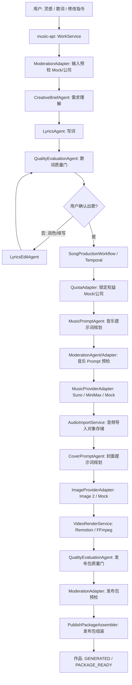
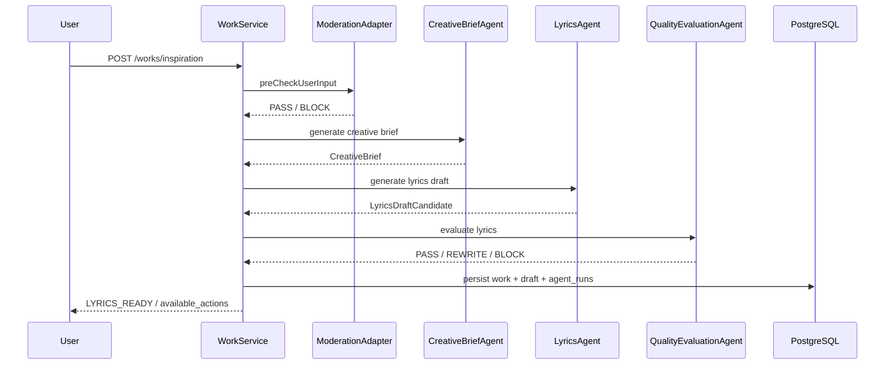
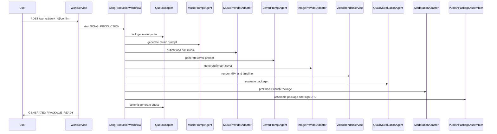

# AI Agent Orchestration Engineering Design v0.1

更新时间：2026-06-06

## 1. 标题与元数据

- 标题：燕云 AI 作曲平台多 Agent 工程编排设计
- 作者：Codex
- 状态：Approved baseline for follow-up implementation
- 适用范围：用户需求理解、AI 写词/润色/续写、音乐提示词规划、Suno / MiniMax 音乐生成、Image 2 封面生成、视频成片、质量评估、审核预检、发布包交接
- 关联文档：
  - `docs/specs/ai-multi-agent-creative-pipeline-v0.1.md`
  - `docs/specs/agent-runtime-audit-v0.1.md`
  - `docs/specs/deepseek-knowledge-lyrics-v0.1.md`
  - `docs/specs/dreammaker-music-provider-v0.1.md`
  - `docs/specs/cover-video-rendering-v0.1.md`
  - `docs/specs/temporal-song-production-orchestration-v0.1.md`

## 2. 设计结论

本项目后续按“确定性 Workflow + 专业 Agent Worker + Provider Adapter”的方向建设。

不采用自由聊天式多 Agent，也不让多个 Agent 自己互相调度、修改数据库或决定最终业务状态。Agent 只负责理解、生成、改写、评估和给出建议；`SongProductionWorkflow` / Temporal、领域 Service 和 Adapter 负责状态机、副作用、重试、幂等、审计、权益和发布包。

核心分工：

- Workflow：持有作品生命周期、生成阶段、权益锁定/扣减/释放、失败收口和发布包状态。
- Agent：返回结构化创作结果、提示词、质量评分、风险提示和推荐动作。
- Adapter：调用真实外部系统，包括 Suno / MiniMax、Image 2、公司审核、公司发布/分享/权益、对象存储等。
- Service：负责领域规则、数据持久化、发布包组装、URL 刷新、幂等和可执行动作。

## 3. 为什么不做“自由多 Agent”

用户提到的方向是合理的：需求理解 Agent、写词 Agent、音乐 Agent、生图 Agent、审核 Agent。真正落地时需要收敛成工程可控形态。

自由多 Agent 的主要风险：

- 状态不可控：多个 Agent 都能推进作品状态时，`works.status`、权益和发布包容易冲突。
- 成本不可控：Agent 互相调用会放大真实模型费用和失败次数。
- 审计困难：公司交接和商用上线需要知道每一次模型调用的输入版本、输出版本、失败码和耗时。
- 回滚困难：真实 Suno / MiniMax / Image 2 都有外部副作用，不能让 LLM 自主决定是否调用。
- 测试困难：自动化测试必须默认不调用真实模型，自由 Agent 很难保证这一点。

因此本项目采用“编排式多 Agent”：每个 Agent 是一个受控 Worker / Client，由 Workflow 明确调用，输入输出都是结构化契约。

## 4. 目标架构



## 5. Agent 清单与职责

| Agent / Adapter | 类型 | 首期职责 | 是否直接改业务状态 |
|---|---|---|---|
| `CreativeBriefAgent` | Agent | 理解用户需求，输出主题、情绪、叙事视角、燕云引用和创作约束 | 否 |
| `LyricsAgent` | Agent | 根据创作简报、知识库和模板生成歌词、标题、摘要和初始 music prompt seed | 否 |
| `LyricsEditAgent` | Agent | 处理 AI 润色、AI 续写和用户修改指令 | 否 |
| `MusicPromptAgent` | Agent | 把最终歌词和创作信息转换为 Suno / MiniMax 友好的音乐生成参数 | 否 |
| `MusicProviderAdapter` | Adapter | 调用 Mock / Suno / MiniMax，提交任务、轮询结果、映射失败码 | 否 |
| `CoverPromptAgent` | Agent | 根据歌词、主题、音乐情绪和燕云视觉规则生成封面 prompt | 否 |
| `ImageProviderAdapter` | Adapter | 调用 Image 2 或 Mock 生图服务，导入封面资产 | 否 |
| `VideoPlanAgent` | Agent | 可选；复杂视频阶段规划镜头、背景和字幕节奏 | 否 |
| `QualityEvaluationAgent` | Agent | 评估歌词、音乐、封面、视频和发布包质量，返回 pass/retry/block 建议 | 否 |
| `ModerationAgent` | Agent | 辅助识别文本、prompt、封面、发布包风险 | 否 |
| `ModerationAdapter` | Adapter | 调用公司审核或 Mock 审核，最终审核口径以公司系统为准 | 否 |

首期优先级：

1. 已有 `LyricsAgent` 审计基础。
2. 已补齐 `MusicPromptAgent`，为 Suno / MiniMax 真实联调做准备。
3. 已补齐 `CreativeBriefAgent`，把用户需求理解从写词服务中抽出来。
4. 已补齐 `CoverPromptAgent`，为 Image 2 真实联调做准备。
5. 下一步补 `QualityEvaluationAgent` 与 `ModerationAgent`。
6. `VideoPlanAgent` 暂缓，等视频表现要求超过当前 Remotion 确定性模板后再启用。

## 6. 编排原则

### 6.1 Workflow 是唯一主编排器

`SongProductionWorkflow` / Temporal 是确认出歌后的唯一主编排器。它负责：

- 推进 `works.status`、`generation_stage`、`package_status`。
- 管理 `generation_jobs`。
- 锁定、释放和扣减权益。
- 决定是否重试、降级、失败或继续下一阶段。
- 调用 Agent / Adapter。
- 组装发布包并进入交接状态。

Agent 不得直接写入上述状态。Agent 输出必须先被 Workflow / Service 校验。

### 6.2 Agent 输出必须结构化

所有 Agent 输出必须是结构化对象，不接受只返回自然语言大段文本后由业务代码猜字段。

最低要求：

```ts
type AgentResult<T> = {
  work_id: string;
  agent_name: string;
  agent_version: string;
  operation: string;
  status: "SUCCEEDED" | "FAILED";
  output?: T;
  recommended_action?: string;
  risk_notes: string[];
  trace: AgentTrace;
};
```

### 6.3 外部模型和公司系统必须走 Adapter

以下能力必须是 Adapter，不应被做成能自由决策的 Agent：

- Suno / MiniMax 音乐任务提交与轮询。
- Image 2 生图请求。
- 对象存储写入和签名 URL。
- 公司账号、权益、审核、发布、分享、推荐流。
- 发布包标记交接。

Adapter 必须支持：

- Mock/Fake 默认实现。
- 真实调用硬开关。
- timeout 和 max attempts。
- 失败码映射。
- provider call 审计。
- 敏感信息脱敏。

## 7. 核心流程

### 7.1 灵感成歌



### 7.2 填词成歌

填词成歌不跳过 Agent。系统仍需要：

- 理解歌词主题和风险。
- 补充标题、摘要、燕云引用、音乐方向和封面 seed。
- 评估歌词是否能进入确认页。

与灵感成歌的区别是：用户歌词作为主文本输入，`LyricsAgent` 更偏整理、补全和结构化，不应无故大改用户原词。

### 7.3 润色和续写

润色和续写统一由 `LyricsEditAgent` 处理，继续沿用用户侧最多 2 次的产品规则。

流程要求：

- 第 1、2 次成功编辑消耗用户编辑次数。
- 第 3 次返回现有 409 友好错误。
- 内部质量重写不消耗用户次数，但必须记录 `agent_runs`。
- 修改后重新跑歌词质量门和风险预检。

### 7.4 确认出歌



## 8. 状态机边界

用户侧 OpenAPI v0.1 状态继续保持稳定。内部 Agent 增加不应导致前端猜状态。

前端仍只依据：

- `status`
- `generation_stage`
- `package_status`
- `available_actions`
- `failure`
- `polish_remaining_count`

后端内部可逐步增加更细的 Agent stage，但不能强迫前端理解每个 Agent 的内部状态。

建议内部 stage 到前端 stage 的映射：

| 内部环节 | 前端阶段 |
|---|---|
| CreativeBriefAgent / LyricsAgent / LyricsQualityEvaluationAgent | `LYRICS_GENERATING` |
| MusicPromptAgent / MusicProviderAdapter | `MUSIC_GENERATING` |
| CoverPromptAgent / ImageProviderAdapter | `COVER_GENERATING` |
| VideoRenderService | `VIDEO_RENDERING` |
| PackageQualityEvaluationAgent / ModerationAdapter / PublishPackageAssembler | `PACKAGE_BUILDING` |

## 9. 审计与数据记录

所有 Agent 调用必须写入 `agent_runs`，所有外部 Provider / Adapter 调用必须写入 `provider_calls` 或等价审计表。

`agent_runs` 最低记录：

- `work_id`
- `agent_name`
- `agent_version`
- `operation`
- `model_name`
- `prompt_template_key`
- `prompt_template_version`
- `input_hash`
- `output_hash`
- `status`
- `latency_ms`
- `failure_code`
- `failure_message`

禁止记录：

- 真实 AccessKey / SecretKey / API Key / JWT / Cookie。
- 完整未脱敏用户敏感输入。
- 完整供应商响应。
- 可被直接复用的签名 URL。

Prompt 原文和输出原文如后续确需存档，必须单独设计加密存储、访问权限和数据保留策略；默认只存 hash 与摘要。

## 10. 失败、重试与降级

| 环节 | 可重试策略 | 降级策略 | 用户可见失败 |
|---|---|---|---|
| `CreativeBriefAgent` | 内部重试 1 次 | 退回更简单 Prompt 模板 | 歌词生成失败，可重新编辑 |
| `LyricsAgent` | 内部重试 1 次 | 使用保守模板生成 | 歌词生成失败，可重新编辑 |
| `LyricsEditAgent` | 网络/模型失败可重试 | 保留原歌词 | 润色/续写失败，用户可再试 |
| `MusicPromptAgent` | 内部重试 1 次 | 使用原始 music prompt seed + 安全默认参数 | 音乐生成失败，可返回编辑 |
| `MusicProviderAdapter` | 按 Provider 限流和失败码决定 | 可切换 Mock 只用于测试，不用于真实用户结果 | `MUSIC_GENERATION_FAILED`，可 `RETRY_MUSIC` |
| `CoverPromptAgent` | 内部重试 1 次 | 使用默认封面 prompt | 封面失败或可重生 |
| `ImageProviderAdapter` | 短重试 | 默认封面兜底 | 封面失败或可重生 |
| `VideoRenderService` | 可重渲 | 无 | `VIDEO_RENDER_FAILED`，可 `RERENDER_VIDEO` |
| `QualityEvaluationAgent` | 不建议多次重试 | 规则引擎兜底 | 根据 blocked/retry 映射 |
| `ModerationAdapter` | 公司系统超时可短重试 | 不绕过公司审核 | `PACKAGE_BLOCKED` 或等待人工 |

失败收口原则：

- Provider 未被调用前失败，不扣主权益。
- 音乐任务成功但后续成片失败，按当前权益策略保留可复核口径，不能重复扣减。
- 发布包不可用时，`package_status` 不得进入 `PACKAGE_READY`。
- 所有用户可见按钮必须由 `available_actions` 驱动。

## 11. 配置与开关

真实模型必须通过显式环境变量开启。默认值必须保持 Mock/Fake，不触发真实成本。

建议配置分组：

```text
AGENT_RUNTIME_ENABLED=true
AGENT_REAL_CALLS_ENABLED=false

DEEPSEEK_REAL_CALLS_ENABLED=false
DEEPSEEK_MODEL_NAME=
DEEPSEEK_TIMEOUT_MS=30000

MUSIC_PROVIDER=mock
DREAMMAKER_REAL_CALLS_ENABLED=false

IMAGE_PROVIDER=mock
IMAGE_REAL_CALLS_ENABLED=false

MODERATION_PROVIDER=mock
COMPANY_ADAPTER_REAL_CALLS_ENABLED=false
```

真实密钥只能通过本地 `.env`、部署 Secret、CI Secret 或公司配置中心注入，不得写入代码、文档、测试、提交信息或日志。

## 12. 测试策略

### 12.1 自动化测试默认只测 Mock

默认测试必须覆盖：

- Agent 输入输出结构。
- Agent 失败时 Workflow 如何收口。
- `agent_runs` 是否写入成功/失败记录。
- `provider_calls` 是否记录外部 Adapter 调用摘要。
- `available_actions` 是否与状态一致。
- 不触发真实 DeepSeek / Suno / MiniMax / Image 2 / 公司系统。

### 12.2 真实模型只做受控 smoke

真实模型联调必须走 runbook：

- 明确本轮使用的模型、Provider、成本上限、样本数量和回滚方式。
- 单次只打开一个真实环节，其余保持 Mock。
- 验证日志不含密钥和完整敏感输入。
- 验证失败码、重试、超时、URL TTL 和对象存储结果。

### 12.3 前端验收不理解 Agent 内部细节

前端只验：

- 五类用户视图：创作首页、歌词确认、生成中、失败、成品。
- 状态由后端返回字段派生。
- 按钮由 `available_actions` 控制。
- 普通用户文案不暴露“发布包 JSON”“Agent run”等内部概念。

## 13. 分阶段实施计划

### Phase A：Agent Runtime 基线

目标：所有 Agent 都能统一记录审计。

已完成：

- `modules:agent-runtime`
- `agent_runs`
- `AgentRunRecorder`
- 写词链路 `LyricsAgent` Mock 审计
- `CreativeBriefAgent` Mock 合约和写词前简报注入
- `MusicPromptAgent` Mock 合约和确认出歌前音乐提示词规划
- `CoverPromptAgent` Mock 合约和封面生成前视觉提示词规划

下一步：

- 补 `QualityEvaluationAgent`、`ModerationAgent` Mock 合约。

### Phase B：DeepSeek 真实写词受控联调

目标：只打开 DeepSeek，音乐/封面/视频仍 Mock。

验收：

- 灵感成歌、填词成歌、润色、续写可受控真实调用。
- `agent_runs` 能看到真实模型名、模板版本、输入输出 hash、失败码。
- 默认测试仍完全 Mock。

### Phase C：Suno / MiniMax 音乐受控联调

目标：音乐链路可分别选择 Suno 或 MiniMax。

实施顺序：

1. `MusicPromptAgent` 输出 provider-specific 参数。
2. DreamMaker JWT 鉴权和 run/status 调用打开真实硬开关。
3. 成功音频导入对象存储。
4. 失败码映射到 `MUSIC_GENERATION_FAILED` 和 `RETRY_MUSIC`。

### Phase D：Image 2 封面受控联调

目标：封面图可真实生成、入库、入包。

验收：

- 16:9 封面输出。
- 风险 prompt 可阻断或改写。
- 生图失败可默认封面兜底或进入可读失败。

### Phase E：质量评估与公司 Adapter

目标：发布包交给公司系统前可解释、可审计、可阻断。

验收：

- `QualityEvaluationAgent` 覆盖歌词、音乐、封面、视频和发布包。
- `ModerationAdapter.preCheckPublishPackage` 与公司审核口径对齐。
- `/internal/integration-readiness` 可以清楚显示 Mock/真实接入状态。

## 14. 决策记录

- 决策 1：Agent 不直接持有业务状态。
- 决策 2：Suno / MiniMax 是 Provider Adapter，不是 LLM Agent。
- 决策 3：Image 2 是 Provider Adapter，封面理解和提示词规划才是 Agent。
- 决策 4：审核分为 AI 预检和公司审核 Adapter，公司审核结果优先级最高。
- 决策 5：真实模型按单环节逐步打开，不一次性全链路真实化。
- 决策 6：`agent_runs` 先记录 hash 和元数据，不默认保存 Prompt 原文。
- 决策 7：前端不暴露 Agent 概念，只消费 OpenAPI v0.1 状态和动作。

## 15. 后续实现检查清单

- 新增 Agent 前，必须先写清输入、输出、失败码、审计字段和 Mock 实现。
- 接真实模型前，必须有硬开关、超时、重试、成本上限和脱敏日志。
- 接真实 Provider 前，必须保证默认测试不会调用外部网络。
- 修改 Workflow 前，必须验证权益锁定/释放/扣减和 job 收口。
- 修改发布包前，必须验证 URL TTL、对象存在性、文件大小、视频可播放和字幕安全区。
- 每完成一个阶段，必须更新 `docs/project-progress.md` 并形成可回退 Git 快照。
