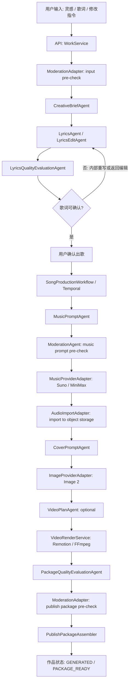

# AI Multi-Agent Creative Pipeline v0.1

更新时间：2026-06-06

## 1. 标题与元数据

- 标题：真实模型阶段的 AI 多 Agent / Worker 创作编排设计
- 作者：Codex
- 状态：Approved for follow-up implementation design
- 适用范围：DeepSeek 写词、Suno / MiniMax 音乐生成、Image 2 封面生成、质量评估、审核预检、MP4 成片和发布包交接
- 评审依据：PRD v0.3、技术方案 v0.2、OpenAPI v0.1、DeepSeek / Knowledge Lyrics Pipeline v0.1、DreamMaker Music Provider Integration Spec v0.1、Cover and Video Rendering Pipeline v0.1、Temporal Song Production Orchestration v0.1
- 工程落地基线：`docs/specs/ai-agent-orchestration-engineering-design-v0.1.md`

## 2. 背景

当前项目已经跑通本地商用闭环：用户可创建作品、确认歌词、进入出歌流程、生成 Mock 音频/封面/视频/发布包，并通过前端原型完成真实后端 UI smoke。系统也已经预置 Suno / MiniMax、DeepSeek、Image 2、Remotion render-worker、公司 Adapter、Outbox 和 Temporal 边界。

但真实模型还没有正式开启：当前写词、音乐、封面、视频、审核和公司系统均默认使用 Mock/Fake 或受控硬开关。下一阶段进入真实模型联调前，需要先明确 AI 多 Agent 的工程形态，避免后续变成不可追踪、不可重试、不可审计的自由聊天式多 Agent 系统。

本设计的核心判断是：创意生成可以 Agent 化，但作品状态、任务调度、权益扣减、失败重试、媒体写入和发布包交接必须由确定性的 Workflow / Service 持有。

## 3. 目标

- 定义真实模型阶段的 Agent、Adapter、Workflow 和 Service 边界。
- 明确哪些步骤由 LLM Agent 承担，哪些步骤只能作为确定性 Provider Adapter。
- 为 DeepSeek、Suno、MiniMax、Image 2、公司审核与发布交接提供统一的接入方向。
- 保持现有 OpenAPI v0.1 用户侧契约稳定，后续主要演进内部任务、状态和观测字段。
- 确保每个模型调用都有输入输出契约、版本、超时、重试、成本、质量和审计记录。

## 4. 非目标

- 不把多个 Agent 设计成可自由修改数据库状态的自治系统。
- 不让 LLM 直接调用权益扣减、发布包交接、公司发布或对象存储写入。
- 不在本设计阶段调用真实 DeepSeek、Suno、MiniMax、Image 2 或公司系统。
- 不新增用户侧账号、审核、权益、分享、推荐流或社区发布实现。
- 不把模型选择完整暴露给普通用户；模型开放策略仍由产品和运营后续决定。

## 5. 核心决策

### 5.1 采用确定性编排 + 专业 Agent Worker

系统继续以 `SongProductionWorkflow` / Temporal 为主编排器，负责状态机、幂等、重试、超时和持久化。每个 Agent 只是被 Workflow 调用的专业 Worker 或 Client，输入输出必须是结构化 payload。

Agent 不拥有最终业务状态，只返回候选结果、评分、风险提示或推荐动作。Workflow 根据确定性规则决定是否进入下一阶段、重试、降级、失败收口或等待人工/公司系统。

### 5.2 Agent 与 Adapter 分工

- Agent：适合处理理解、生成、改写、评估、提示词规划、风险解释等非确定性创意/判断任务。
- Adapter：适合处理外部系统调用、任务提交、轮询、下载、上传、签名 URL、公司接口和对象存储等确定性副作用。
- Service：适合处理领域规则、状态流转、权益、幂等、发布包组装和数据持久化。

音乐模型调用本身不应被设计成 LLM Agent，而应是 `MusicProviderAdapter`：它接收确定性的音乐生成参数，提交 Suno / MiniMax 任务，轮询结果，并把供应商音频导入平台对象存储。

### 5.3 按阶段接入，不一次性打开所有真实模型

真实模型接入顺序应从低副作用、低成本、易回滚的环节开始：

1. DeepSeek 需求理解与写词 Agent。
2. 音乐提示词 Agent。
3. Suno / MiniMax 音乐 Provider 受控调用。
4. 封面提示词 Agent 与 Image 2 Provider 受控调用。
5. 质量评估、审核预检和公司 Adapter 联调。

每个阶段必须保持 Mock/Fake 可回退，自动化测试默认不得调用真实模型。

## 6. 目标架构



首期实现可以暂不启用 `VideoPlanAgent`，继续使用确定性 render-worker 和歌词时间轴生成；等真实视频表现需要更复杂分镜、背景、镜头节奏时再启用。

## 7. 组件职责

### 7.1 CreativeBriefAgent

职责：理解用户故事、主题、情绪、角色、场景和燕云风格诉求，输出结构化创作简报。

输入：用户灵感、用户歌词、创作模式、用户可选偏好、知识库引用。

输出：`CreativeBrief`，包括主题、情绪、叙事视角、曲风方向、禁区、燕云引用、用户意图摘要。

实现建议：首期使用 DeepSeek；必须保留 `MockCreativeBriefAgent`。

### 7.2 LyricsAgent

职责：根据 `CreativeBrief`、知识库引用和 Prompt 模板生成歌词草案、标题、摘要、music prompt 初稿、封面 seed。

输入：`CreativeBrief`、写词模式、知识库片段、Prompt 模板版本。

输出：`LyricsDraftCandidate`。

实现建议：复用当前 `LyricsGenerationService` 的 Knowledge / Prompt / DeepSeek 边界，后续把 Mock DeepSeek 客户端替换为受控真实客户端。

### 7.3 LyricsEditAgent

职责：处理 AI 润色和 AI 续写。首期可作为 `LyricsAgent` 的 operation mode，不必独立成模块；当润色策略、续写策略和风格迁移明显变复杂后再拆分。

输入：当前歌词版本、用户修改指令、剩余次数、历史版本摘要。

输出：新的 `LyricsDraftCandidate`。

约束：用户侧 AI 编辑次数仍按现有 2 次上限执行；内部质量重写不消耗用户次数，但必须有审计记录。

### 7.4 MusicPromptAgent

职责：把歌词、创作简报和用户确认信息转换成供应商友好的音乐生成参数。

输入：`CreativeBrief`、最终歌词、歌曲标题、摘要、目标 Provider、平台策略。

输出：`MusicGenerationPrompt`，包括 style prompt、negative prompt、结构建议、节奏/情绪标签、provider-specific 参数。

约束：不得直接提交音乐任务，只能返回参数。

### 7.5 MusicProviderAdapter

职责：按统一 `MusicProvider` 合约调用 Suno / MiniMax，提交任务、轮询状态、映射失败码、返回供应商音频源信息。

输入：`MusicGenerationPrompt` 与平台生成参数。

输出：`MusicGenerationResult`。

约束：这不是 LLM Agent。它是确定性外部 Provider Adapter，必须支持硬开关、超时、限流、失败码映射、调用记录和敏感信息脱敏。

### 7.6 QualityEvaluationAgent

职责：评估歌词、音乐结果、封面提示、视频结果和发布包质量，输出是否可进入下一阶段、是否建议重试、是否需要降级或人工处理。

输入：候选结果、平台质量规则、媒体元数据、失败历史。

输出：`QualityGateResult`。

首期优先覆盖：

- 歌词质量：主题完整度、敏感风险、燕云相关性、重复度。
- 音乐质量：供应商状态、时长、音频可访问性、是否缺失输出。
- 视频质量：MP4 可播放、16:9、字幕安全区、文件大小、时长匹配。
- 发布包质量：音频/封面/视频/timeline URL 均可用，URL TTL 符合交接要求。

### 7.7 CoverPromptAgent

职责：把作品主题、歌词、燕云引用、音乐情绪转换为封面生成 prompt。

输入：`CreativeBrief`、最终歌词、音乐元数据、平台视觉约束。

输出：`CoverGenerationPrompt`。

约束：不得直接调用 Image 2；真实生成由 `ImageProviderAdapter` 完成。

### 7.8 ImageProviderAdapter

职责：调用 Image 2 或后续替换的生图服务，生成封面、导入对象存储、返回平台资产描述。

输入：`CoverGenerationPrompt`。

输出：`CoverGenerationResult` 或 `MediaAssetDescriptor`。

约束：默认 Mock；真实调用必须有硬开关、成本止损、失败码映射和内容安全兜底。

### 7.9 VideoPlanAgent

职责：为更复杂的视频生成提供镜头、背景、字幕节奏和视觉层级规划。

首期状态：可选，不作为真实模型接入第一阶段必需项。

理由：当前 render-worker 已能用确定性歌词时间轴生成 16:9 MP4；在视频表现要求提高前，引入视频规划 Agent 会增加成本和不确定性。

### 7.10 ModerationAgent 与 ModerationAdapter

职责拆分：

- `ModerationAgent`：负责 LLM 辅助风险识别、解释和建议，可用于输入文本、歌词、音乐 prompt、封面 prompt 和发布包风险预检。
- `ModerationAdapter`：负责调用公司或权威审核系统，是最终审核口径的 Adapter。

关键原则：公司真实审核结果优先级高于 AI 预检。AI 预检可以提前阻断明显风险，但不能绕过公司审核策略。

### 7.11 PublishPackageAssembler

职责：组装发布包 JSON、写对象存储、签发 URL、刷新 URL、标记交接。

约束：这是确定性 Service，不是 Agent。发布包内容必须来自已持久化资产和审核结果，不允许 LLM 临时拼接最终发布包。

## 8. 核心数据契约

以下契约是内部边界口径，字段名采用 OpenAPI 风格，后续实现可映射为 Java record / DTO。

```ts
type CreativeBrief = {
  work_id: string;
  input_mode: "INSPIRATION" | "LYRICS";
  user_intent_summary: string;
  theme: string;
  mood_tags: string[];
  narrative_viewpoint?: string;
  music_direction?: string;
  yanyun_references: string[];
  constraints: string[];
  risk_notes: string[];
  model_trace: AgentTrace;
};

type LyricsDraftCandidate = {
  work_id: string;
  title: string;
  lyrics_text: string;
  song_summary: string;
  music_prompt_seed: string;
  cover_prompt_seed: string;
  yanyun_references: string[];
  quality_score: number;
  knowledge_base_version: string;
  prompt_template_versions: Record<string, number>;
  risk_notes: string[];
  model_trace: AgentTrace;
};

type MusicGenerationPrompt = {
  work_id: string;
  provider: "SUNO" | "MINIMAX";
  title: string;
  lyrics_text: string;
  style_prompt: string;
  negative_prompt?: string;
  duration_target_ms?: number;
  provider_params: Record<string, unknown>;
  model_trace: AgentTrace;
};

type MusicGenerationResult = {
  work_id: string;
  provider: "MOCK" | "SUNO" | "MINIMAX";
  status: "SUCCEEDED" | "FAILED" | "TIMEOUT";
  provider_task_id?: string;
  provider_trace_id?: string;
  audio_source_url?: string;
  audio_object_key?: string;
  duration_ms?: number;
  failure_code?: string;
  retryable?: boolean;
};

type CoverGenerationPrompt = {
  work_id: string;
  title: string;
  visual_prompt: string;
  negative_prompt?: string;
  width: 1920;
  height: 1080;
  style_constraints: string[];
  model_trace: AgentTrace;
};

type QualityGateResult = {
  work_id: string;
  gate: "LYRICS" | "MUSIC" | "COVER" | "VIDEO" | "PUBLISH_PACKAGE";
  decision: "PASS" | "REWRITE" | "RETRY" | "BLOCK" | "MANUAL_REVIEW";
  score?: number;
  reasons: string[];
  recommended_action?: string;
  retryable?: boolean;
  model_trace?: AgentTrace;
};

type ModerationDecision = {
  work_id: string;
  target: "USER_INPUT" | "LYRICS" | "MUSIC_PROMPT" | "COVER_PROMPT" | "COVER_IMAGE" | "PUBLISH_PACKAGE";
  decision: "PASS" | "BLOCK" | "MANUAL_REVIEW";
  risk_codes: string[];
  message?: string;
  source: "AI_PRECHECK" | "COMPANY_ADAPTER" | "MOCK";
};

type AgentTrace = {
  agent_name: string;
  agent_version: string;
  model_name: string;
  prompt_template_version?: string;
  input_hash: string;
  output_hash: string;
  latency_ms: number;
  token_usage?: {
    input_tokens?: number;
    output_tokens?: number;
  };
};
```

## 9. 状态与副作用边界

Agent 允许返回：

- 候选文本、候选 prompt、候选策略。
- 质量分、风险标签、建议动作。
- 可重试/不可重试建议。
- 用于审计的模型版本、模板版本、hash、耗时和成本。

Agent 不允许直接执行：

- 更新 `works` 终态。
- 扣减或释放权益。
- 写入发布包对象。
- 标记发布包已交接。
- 直接调用公司发布、分享、互动或推荐流。
- 保存真实密钥、原始供应商响应或未脱敏敏感内容。

Workflow / Service 必须持有：

- `works.status`、`generation_stage`、`package_status`、`version`。
- `generation_jobs` 生命周期。
- `provider_calls` 与 `agent_runs` 类审计记录。
- 权益锁定、释放和提交。
- Outbox / Temporal 启动一致性。
- 发布包组装、URL 签发和交接状态。

## 10. 失败与重试策略

每个 Agent / Adapter 调用必须配置：

- timeout。
- max attempts。
- idempotency key，建议由 `work_id + stage + version + attempt` 派生。
- 输入 hash 与输出 hash。
- sanitized failure code 与 failure message。
- retryable / non-retryable 判断。

失败收口建议：

| 环节 | 失败类型 | 收口 |
|---|---|---|
| CreativeBriefAgent | 模型超时或低质量 | 内部重试 1 次；仍失败则返回可编辑失败 |
| LyricsAgent | 低质量或格式不合格 | 内部重写 1 次；仍失败则返回歌词生成失败 |
| LyricsEditAgent | 第三次用户编辑 | 沿用 409 友好提示，不消耗次数 |
| MusicPromptAgent | 参数不合格 | 阻断出歌，返回可编辑失败 |
| MusicProviderAdapter | 供应商超时/失败 | 进入 `MUSIC_GENERATION_FAILED`，按现有重试次数开放 `RETRY_MUSIC` |
| AudioImportAdapter | 下载或对象存储失败 | 进入 `PACKAGE_BUILD_FAILED`，释放权益 |
| CoverPromptAgent | prompt 风险或质量低 | 重写 1 次；仍失败使用默认封面或阻断 |
| ImageProviderAdapter | 生图失败 | 首期可默认封面兜底；若不可兜底则 `PACKAGE_BUILD_FAILED` |
| VideoRenderService | 渲染失败 | `PACKAGE_BUILD_FAILED`，不生成发布包 |
| ModerationAdapter | 审核阻断 | `PACKAGE_BLOCKED` 或回到编辑，按公司规则 |
| PublishPackageAssembler | 发布包写入失败 | `PACKAGE_BUILD_FAILED`，不扣减主权益 |

真实模型阶段建议把 Temporal activity 从当前单一生产委托拆细为：

- `GenerateCreativeBriefActivity`
- `GenerateLyricsActivity`
- `EvaluateLyricsActivity`
- `GenerateMusicPromptActivity`
- `SubmitAndPollMusicActivity`
- `ImportAudioActivity`
- `GenerateCoverPromptActivity`
- `GenerateCoverActivity`
- `RenderVideoActivity`
- `EvaluatePackageActivity`
- `PreCheckPublishPackageActivity`
- `AssemblePublishPackageActivity`

## 11. 审核与安全门

建议保留以下审核点：

1. 用户输入预检：创建作品前，阻断明显违规输入。
2. 歌词草案预检：歌词确认前，避免用户确认高风险歌词。
3. 音乐 prompt 预检：提交供应商前，避免把高风险内容发送外部模型。
4. 封面 prompt / 封面图预检：生成和入包前分别检查。
5. 发布包预检：成片可交接前调用 `ModerationAdapter.preCheckPublishPackage`。

本地阶段所有审核仍可由 Mock Adapter 返回通过；公司接入阶段以公司审核系统结果为最终口径。

## 12. 观测、审计与成本

后续建议新增或扩展审计记录，用于模型联调和公司交接：

- `agent_runs`：记录 agent name、version、model、stage、input hash、output hash、latency、token usage、decision、failure code。
- `provider_calls`：继续记录 Suno / MiniMax / Image 2 / render-worker / 公司 Adapter 的调用摘要。
- OpenTelemetry trace：贯穿 `work_id`、`job_id`、`workflow_id`、`agent_run_id`、`provider_call_id`。
- Prometheus metrics：按 agent/provider 统计成功率、失败码、耗时、重试次数、成本估算。
- 日志规则：不得输出真实凭据、JWT、用户 token、完整供应商响应、完整 Prompt 或未脱敏用户敏感内容。

## 13. 分阶段实施计划

### Phase 0：设计冻结

当前阶段。新增本设计文档，作为后续真实模型接入方向。

验收：文档明确 Agent / Adapter / Workflow 边界，并同步项目进度。

### Phase 1：Agent Runtime 与 Mock Contracts

新增内部 Agent 合约与 Mock 实现，不调用真实模型：

- `CreativeBriefAgent`
- `LyricsAgent` / `LyricsEditAgent`
- `MusicPromptAgent`
- `QualityEvaluationAgent`
- `CoverPromptAgent`
- `ModerationAgent`

验收：现有本地 Mock 主链路仍通过；`provider_calls` 或新增 `agent_runs` 可追踪每个 Agent mock run。

当前落地状态：`agent_runs` v0.1 与 `AgentRunRecorder` 已完成，写词链路的 `CreativeBriefAgent` 和 `LyricsAgent` Mock 调用已接入审计；`MusicPromptAgent` v0.1 Mock 合约已接入 `SongProductionWorkflow`，确认出歌前会生成 Provider 侧音乐提示词并写入 `agent_runs`；`CoverPromptAgent` v0.1 Mock 合约已接入封面生成前置步骤，封面 visual prompt 会进入媒体资产 metadata；`QualityEvaluationAgent` v0.1 Mock 合约已接入发布包写入前质量门。`ModerationAgent` 仍待补 Mock 合约。

### Phase 2：DeepSeek 真实写词受控联调

先接真实 `CreativeBriefAgent` 和 `LyricsAgent`，继续保持音乐、封面、视频 Mock。

验收：灵感成歌、填词成歌、润色、续写可受控调用真实 DeepSeek；失败可回退 Mock；日志和数据库不泄露敏感信息。

### Phase 3：音乐提示词 + Suno / MiniMax 受控联调

接入真实 `MusicPromptAgent`，再按 runbook 各跑 Suno / MiniMax 最小成功路径。

验收：真实供应商音频成功导入对象存储；失败码、超时、限流和重试策略有样本记录。

### Phase 4：封面提示词 + Image 2 受控联调

接入 `CoverPromptAgent` 和真实生图 Provider，优先保证 16:9 封面可入包。

验收：封面图可生成、存储、进入发布包；风险内容可阻断或兜底。

### Phase 5：质量评估、审核和公司 Adapter

补齐质量评估 Agent、公司审核 Adapter、公司权益/发布/分享交接验证。

验收：`/internal/integration-readiness` 不再只显示 Mock；发布包可被公司系统替换 Adapter 后接收。

## 14. 验收标准

- AC-1：后续实现中，所有 LLM 类能力均通过 Agent 合约接入，不直接散落在业务 Service 中。
- AC-2：Suno / MiniMax / Image 2 / 公司系统均通过 Adapter 接入，不被包装成可自由决策的 Agent。
- AC-3：Workflow 持有状态与副作用；Agent 只返回结构化结果和建议。
- AC-4：每个 Agent / Adapter 均有 Mock/Fake 实现，自动化测试默认不调用真实外部系统。
- AC-5：每次真实模型调用都有 trace、hash、版本、耗时、失败码和脱敏日志。
- AC-6：真实模型阶段前，Temporal activity 必须拆到可重试、可幂等、可定位失败的粒度。
- AC-7：发布包可交接前必须经过质量检查和发布包预检。

## 15. 后续待办

- 在技术方案 v0.2 后续版本中补入本设计的 Agent / Adapter 分层口径。
- 扩展 Agent Runtime 配置：模型名、硬开关、成本限制、超时、重试、Prompt 模板版本。
- 继续补齐 `ModerationAgent` 的 Mock 合约与审计；歌词、音乐等更细粒度质量门可在 `QualityEvaluationAgent` v0.2 扩展。
- 梳理 DeepSeek 真实接入 runbook：输入脱敏、Prompt 版本、失败码、限流、回退 Mock。
- 梳理 Image 2 真实接入 runbook：尺寸、风格、内容安全、默认封面兜底和对象存储导入。
- 在真实模型联调前，把 `SongProductionWorkflow` 拆为更细粒度 Temporal activities。
