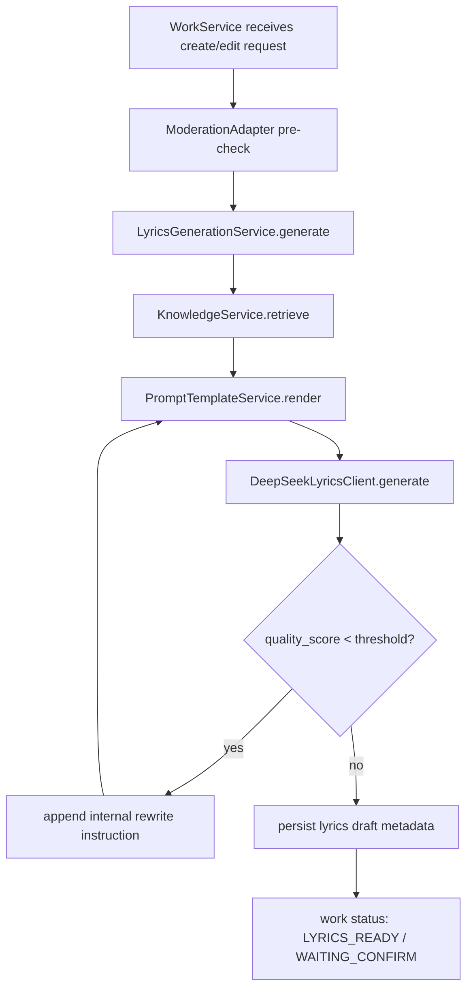

# DeepSeek / Knowledge Lyrics Pipeline v0.1

更新时间：2026-06-06

## 目标

第 6 批目标是在不调用真实 DeepSeek、不改变 OpenAPI v0.1 主路径的前提下，把写词、润色、续写从 `WorkService` 内部硬编码 Mock 拆成可替换的商用级边界：

- `KnowledgeService`：负责从燕云知识库检索写词参考。
- `PromptTemplateService`：负责按业务场景渲染 Prompt。
- `DeepSeekLyricsClient`：负责模型生成边界，当前只提供 Mock 实现。
- `LyricsGenerationService`：负责把知识库、Prompt 和模型结果编排成结构化歌词草案。

本批完成后，本地 Mock 阶段的灵感成歌、填词成歌、AI 润色、AI 续写都应通过同一套写词链路生成歌词，并持久化知识库版本、Prompt 模板版本、封面提示 seed、质量分和燕云引用。

## 非目标

- 不调用真实 DeepSeek API。
- 不把真实 DeepSeek Key、JWT、用户 Token 或 Prompt 原文写入仓库、日志、测试或文档。
- 不新增用户侧 OpenAPI 路径；继续复用 `/works/inspiration`、`/works/lyrics`、`/lyrics/polish`、`/lyrics/continue`。
- 不实现 RAG 索引、向量检索或知识库后台管理。
- 不实现最终前端视觉；前端后续仍以 Gemini 任务包形式交接。

## 功能要求

- FR-1：灵感成歌必须从用户故事输入生成歌词、歌曲摘要、音乐提示词和封面提示 seed。
- FR-2：填词成歌必须保留用户输入歌词作为核心文本，并补齐摘要、音乐提示词和元数据。
- FR-3：AI 润色必须基于当前歌词和用户指令生成新版歌词草案。
- FR-4：AI 续写必须基于当前歌词和用户指令生成新版歌词草案。
- FR-5：AI 润色和 AI 续写共享用户侧编辑次数，当前上限为 2 次。
- FR-6：模型返回质量分低于内部阈值时，服务可自动追加一次重写指令并重新生成；该内部重写不消耗用户侧编辑次数。
- FR-7：每次生成结果必须携带 `knowledge_base_version` 和 `prompt_template_versions`，用于后续审计与回放。
- FR-8：作品详情继续向用户暴露 `lyrics_draft.yanyun_references`；知识库版本和模板版本先作为后端持久化审计字段，不在当前 OpenAPI v0.1 额外暴露。
- FR-9：自动化测试必须使用 Mock/Fake，不得触发真实 DeepSeek、Suno、MiniMax、Image 2 或公司系统。

## 编排流程

## 持久化口径

`lyrics_drafts` 本批启用以下既有字段：

| 字段 | 口径 |
|---|---|
| `cover_prompt_seed` | 封面生成前置提示 seed，供第 7 批 Image 2 / 封面链路使用 |
| `quality_score` | 模型或 Mock 返回的质量评分 |
| `knowledge_base_version` | 本次检索使用的知识库版本 |
| `prompt_template_versions` | 本次生成使用的 Prompt 模板 key 与版本 |
| `yanyun_references_json` | 用户侧可展示的燕云参考名列表 |
| `risk_notes_json` | 写词风险提示，后续可接入审核策略 |

## Mock 策略

- `MockKnowledgeService` 固定返回 2 条燕云参考，版本为 `mock-yanyun-kb-v0`。
- `MockPromptTemplateService` 固定按 operation 渲染 Prompt，并返回模板 key 和版本。
- `MockDeepSeekLyricsClient` 根据 operation 生成确定性歌词、摘要、音乐提示词、封面 seed 和质量分。
- 真实 DeepSeek 客户端后续必须复用 `DeepSeekLyricsClient` 合约，并增加独立硬开关、脱敏日志和失败码映射；受控联调步骤见 `docs/runbook/deepseek-controlled-real-integration.md`，安全规则见 `docs/security/deepseek-secret-and-log-handling.md`，验收清单见 `docs/checklists/deepseek-real-integration-acceptance.md`。

## 验收标准

- AC-1：`POST /api/v1/works/inspiration` 成功后，作品进入 `LYRICS_READY / WAITING_CONFIRM`，歌词草案来自 `LyricsGenerationService`。
- AC-2：`POST /api/v1/works/lyrics` 成功后，用户输入歌词被保留为主要歌词文本。
- AC-3：`POST /api/v1/works/{work_id}/lyrics/polish` 成功后，新增歌词草案版本，并消耗 1 次 AI 编辑次数。
- AC-4：`POST /api/v1/works/{work_id}/lyrics/continue` 成功后，新增歌词草案版本，并消耗 1 次 AI 编辑次数。
- AC-5：累计 2 次 AI 编辑后，再次润色或续写返回 HTTP 409。
- AC-6：低质量 Mock/Fake 模型结果会触发一次内部重写，最终结果使用第二次返回。
- AC-7：`lyrics_drafts` 持久化知识库版本、Prompt 模板版本、封面 seed 和质量分。
- AC-8：`./gradlew spotlessCheck test :apps:music-api:bootJar` 成功。
- AC-9：HTTP smoke 不调用真实 DeepSeek、DreamMaker、Image 2 或公司系统。

## 后续事项

1. 第 7 批封面链路应优先读取 `cover_prompt_seed`，再调用 Image 生成或 Mock 封面 Adapter。
2. 真实 DeepSeek 接入前已补受控联调 runbook、安全日志规则和验收清单；下一步需在用户提供 URL / API Key / 协议后实现真实客户端硬开关。
3. 若后续 OpenAPI 需要展示 `knowledge_base_version` 或质量分，应先升级接口契约版本，并同步 Gemini 前端任务包。
