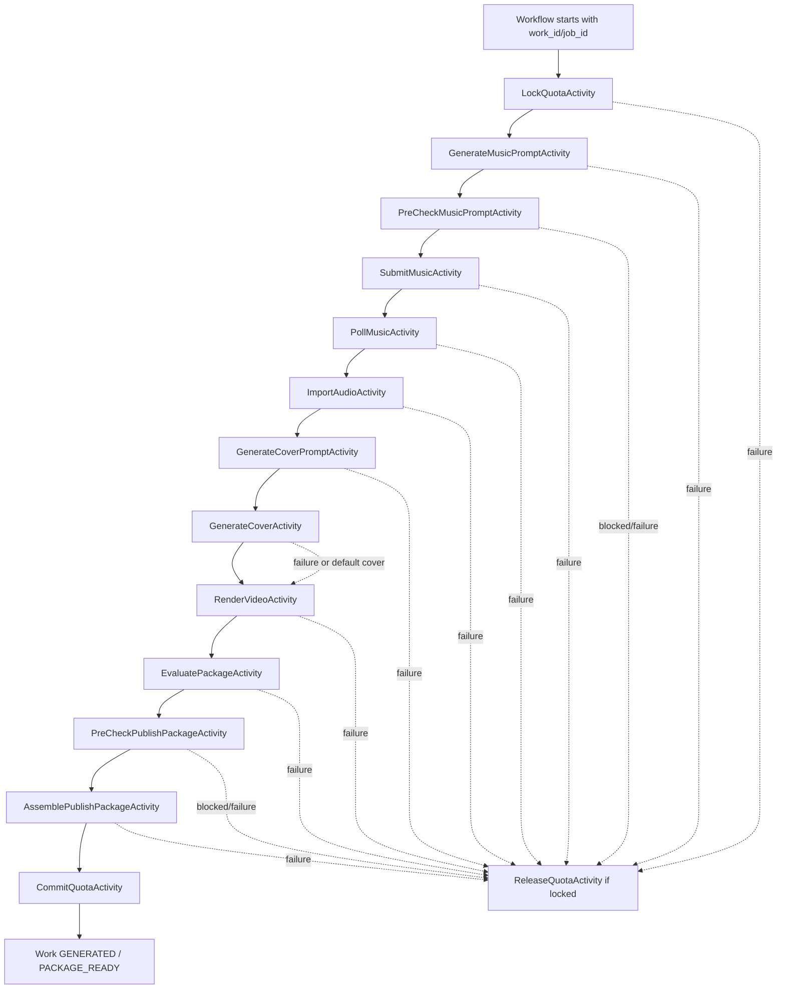

# Temporal Activity Decomposition v0.1

更新时间：2026-06-06

## 1. 标题与元数据

- 标题：真实模型阶段前的 Temporal Activity 细化设计
- 作者：Codex
- 状态：Draft for implementation planning
- 适用范围：`SongProductionWorkflow`、Temporal worker、真实模型受控联调前的编排拆分
- 评审依据：Temporal Song Production Orchestration v0.1、AI Agent Orchestration Engineering Design v0.1、AI Agent Architecture Direction v0.1、DeepSeek / Image 2 / DreamMaker 受控联调 Runbook

## 2. 背景

当前 Temporal v0.1 已证明 API 可以通过 outbox 启动独立 `music-worker`，但 worker 仍只有一个粗粒度 `SongProductionActivities.produce`。该 activity 内部委托给完整 `MockSongProductionWorkflow`，一次性处理权益、音乐、封面、视频、质量门、发布包审核和写包。

这种实现适合本地 Mock 阶段，但不适合真实模型阶段。真实 DeepSeek、Suno、MiniMax、Image 2、render-worker 和公司 Adapter 都可能出现不同的超时、限流、失败码、重试策略和成本风险。如果仍用一个大 activity，Temporal 无法精确重试单个步骤，也难以定位“音乐已成功但封面失败”或“视频已生成但发布包写入失败”的状态。

本规格定义真实模型接入前的 activity 细化目标。它不要求立即重写全部生产代码，而是给后续实现提供可执行边界：先保留当前单 activity 作为兼容路径，再逐步把副作用步骤拆成幂等 activity。

## 3. 功能需求

- FR-1：系统 MUST 保留当前单 activity 兼容路径，直到细化 activity 通过本地 smoke。
- FR-2：系统 MUST 把真实模型和外部副作用拆成独立 Temporal activity。
- FR-3：每个 activity MUST 接收明确输入、返回结构化结果，并只负责一个可解释副作用或决策步骤。
- FR-4：每个 activity MUST 使用 `work_id`、`job_id` 和步骤名构造幂等键，避免重试产生重复扣费、重复提交或重复写包。
- FR-5：音乐提交与轮询 MUST 拆成可定位的 activity，至少区分提交任务、轮询结果、导入音频。
- FR-6：封面提示词、封面生成、视频渲染、发布包质量门、发布包预检和发布包写入 MUST 能分别记录成功/失败。
- FR-7：Workflow MUST 持有状态推进顺序；Agent 和 Provider activity MUST NOT 自行决定跳过状态机、扣减权益或发布包交接。
- FR-8：activity 失败 MUST 映射到现有用户可见状态、`generation_stage`、失败码和 `available_actions`。
- FR-9：自动化测试 MUST 默认使用 Mock/Fake activity，不调用真实 DeepSeek、DreamMaker、Image 2 或公司系统。

## 4. 非功能需求

- NFR-1：每个真实外部调用 activity MUST 有显式 timeout、max attempts、retryable / non-retryable 规则和成本止损。
- NFR-2：activity 日志、Temporal history、数据库错误字段 MUST NOT 包含密钥、JWT、用户 token、完整 Prompt、供应商完整 payload 或供应商临时 URL。
- NFR-3：activity 输出必须足够小，避免把大歌词、完整视频 timeline、完整供应商响应塞入 Temporal history。
- NFR-4：可恢复性优先于代码复用；如果某个步骤有外部副作用，必须能通过数据库或供应商 trace id 判定是否已经完成。
- NFR-5：本地 Mock 主链路和前端真实后端 smoke 不得因 activity 细化而退化。

## 5. 推荐 Activity 列表

| Activity | 主要职责 | 真实外部副作用 | 幂等依据 | 主要失败码 |
|---|---|---|---|---|
| `LockQuotaActivity` | 锁定主出歌权益 | 公司权益 Adapter | `work_id + job_id + QUOTA_LOCK` | `QUOTA_LOCK_FAILED` |
| `GenerateMusicPromptActivity` | 生成音乐 Provider 参数 | LLM Agent，可 Mock | `work_id + job_id + MUSIC_PROMPT` | `MUSIC_PROMPT_FAILED` |
| `PreCheckMusicPromptActivity` | AI 预检音乐 prompt | LLM / 审核 Agent，可 Mock | `work_id + job_id + MUSIC_PROMPT_PRECHECK` | `MUSIC_PROMPT_BLOCKED` |
| `SubmitMusicActivity` | 提交 Suno / MiniMax 任务 | DreamMaker | `work_id + job_id + provider + SUBMIT` | `MUSIC_SUBMIT_FAILED` |
| `PollMusicActivity` | 轮询音乐任务结果 | DreamMaker | provider task id | `MUSIC_GENERATION_FAILED` |
| `ImportAudioActivity` | 下载并导入供应商音频 | 供应商 URL + 对象存储 | audio source hash / object key | `AUDIO_IMPORT_FAILED` |
| `GenerateCoverPromptActivity` | 生成封面 visual prompt | LLM Agent，可 Mock | `work_id + job_id + COVER_PROMPT` | `COVER_PROMPT_FAILED` |
| `GenerateCoverActivity` | 调用 Image 2 或默认封面 | Image 2 / 对象存储 | `work_id + job_id + COVER` | `COVER_GENERATION_FAILED` |
| `RenderVideoActivity` | 调用 render-worker 输出 MP4/timeline | 本地进程 / worker | `work_id + job_id + VIDEO` | `VIDEO_RENDER_FAILED` |
| `EvaluatePackageActivity` | 发布包质量门 | LLM / 规则，可 Mock | `work_id + job_id + PACKAGE_QUALITY` | `PACKAGE_QUALITY_FAILED` |
| `PreCheckPublishPackageActivity` | 公司审核前预检 | AI / 公司审核 Adapter | `work_id + job_id + PUBLISH_PRECHECK` | `PACKAGE_BLOCKED` |
| `AssemblePublishPackageActivity` | 组装并写入发布包 JSON | 对象存储 | package object key | `PACKAGE_BUILD_FAILED` |
| `CommitQuotaActivity` | 扣减主出歌权益 | 公司权益 Adapter | `work_id + job_id + QUOTA_COMMIT` | `QUOTA_COMMIT_FAILED` |
| `ReleaseQuotaActivity` | 失败释放权益 | 公司权益 Adapter | `work_id + job_id + QUOTA_RELEASE` | `QUOTA_RELEASE_FAILED` |

## 6. Workflow 顺序



## 7. 验收标准

- AC-1：Given 默认同步 Mock 模式，When 运行本地主链路 smoke，Then 仍可进入 `GENERATED / PACKAGE_READY`，覆盖 FR-1。
- AC-2：Given Temporal activity 细化开关打开，When worker 执行出歌流程，Then 每个 activity 只执行对应步骤，覆盖 FR-2、FR-3。
- AC-3：Given `SubmitMusicActivity` 成功但 `PollMusicActivity` 超时，When 重试轮询，Then 不重复提交供应商任务，覆盖 FR-4、FR-5。
- AC-4：Given `ImportAudioActivity` 成功但 `GenerateCoverActivity` 失败，When 使用默认封面兜底，Then 音频对象不重复导入，覆盖 FR-4、FR-6。
- AC-5：Given `RenderVideoActivity` 失败，When Workflow 收口，Then 作品进入可读失败状态、权益释放、发布包不生成，覆盖 FR-8。
- AC-6：Given 自动化测试运行，When 执行 Gradle 和 smoke，Then 不调用真实 DeepSeek、DreamMaker、Image 2 或公司系统，覆盖 FR-9、NFR-5。
- AC-7：Given 日志和数据库错误字段，When 真实外部 activity 失败，Then 不出现密钥、完整 Prompt 或供应商完整 payload，覆盖 NFR-2。

## 8. 边界情况

- EC-1：Workflow 重放时，activity 输入必须稳定，不从当前时间或随机数直接生成幂等键。
- EC-2：供应商提交成功但本地进程崩溃时，后续执行必须能用 `provider_calls.provider_trace_id` 恢复轮询。
- EC-3：对象存储写入成功但数据库写入失败时，下一次重试应复用 object key 或清理孤儿对象，不生成多个发布包 URL。
- EC-4：权益 commit 失败但发布包已写入时，作品不得对用户显示为可交接，必须进入后台可复核状态。
- EC-5：公司审核阻断时，公司审核结果优先级高于 AI 预检；Workflow 必须按 `PACKAGE_BLOCKED` 或公司确认的失败码收口。
- EC-6：Temporal activity 自动重试不得覆盖业务重试次数，例如音乐重试上限仍由作品状态机控制。

## 9. 内部合约

示例合约方向，实际 Java record 可按模块边界拆分：

```java
record ActivityContext(
    UUID workId,
    UUID jobId,
    String userId,
    String idempotencyKey,
    String operation) {}

record ActivityResult(
    boolean success,
    String status,
    String failureCode,
    String failureMessage,
    Map<String, String> references) {}
```

Activity 接口方向：

```java
interface SongProductionStepActivities {
  QuotaLockResult lockQuota(ActivityContext context);
  MusicPromptResult generateMusicPrompt(ActivityContext context);
  MusicTaskResult submitMusic(ActivityContext context, MusicPromptResult prompt);
  MusicResult pollMusic(ActivityContext context, MusicTaskResult task);
  MediaAssetResult importAudio(ActivityContext context, MusicResult music);
  CoverPromptResult generateCoverPrompt(ActivityContext context);
  MediaAssetResult generateCover(ActivityContext context, CoverPromptResult prompt);
  VideoRenderResult renderVideo(ActivityContext context, MediaAssetResult audio, MediaAssetResult cover);
  QualityDecision evaluatePackage(ActivityContext context);
  PublishPackageResult assemblePublishPackage(ActivityContext context);
}
```

## 10. 数据模型

短期可继续复用现有表：

| 表 | 作用 |
|---|---|
| `generation_jobs` | 记录整体生产 job 状态、stage 和失败码 |
| `provider_calls` | 记录 Suno / MiniMax / Image 2 等外部 Provider 调用摘要 |
| `agent_runs` | 记录 Agent 输入输出 hash、模型名、模板版本和失败信息 |
| `media_assets` | 记录音频、封面、视频、timeline 平台资产 |
| `publish_packages` | 记录发布包 JSON、object key、URL 和交接状态 |
| `workflow_outbox` | 记录 API 到 Temporal worker 的启动请求 |

若后续需要更细审计，SHOULD 新增 `generation_job_steps`：

| 字段 | 口径 |
|---|---|
| `id` | step id |
| `job_id` | 对应 generation job |
| `work_id` | 对应作品 |
| `step_name` | activity 名称 |
| `idempotency_key` | `work_id + job_id + step_name` |
| `status` | `PENDING` / `RUNNING` / `SUCCEEDED` / `FAILED` / `SKIPPED` |
| `attempt_count` | activity 尝试次数 |
| `external_trace_id` | 供应商 task id 或对象 key |
| `failure_code` | 脱敏失败码 |
| `failure_message` | 脱敏短错误 |
| `started_at` / `completed_at` | 时间戳 |

## 11. 非目标

- OS-1：本规格不立即实现 activity 拆分代码。
- OS-2：不在自动化测试中调用真实 DeepSeek、DreamMaker、Image 2 或公司系统。
- OS-3：不改变 OpenAPI v0.1 用户侧响应结构。
- OS-4：不改变前端状态派生规则；前端仍只消费 `status`、`generation_stage`、`package_status`、`failure` 和 `available_actions`。
- OS-5：不把供应商完整请求/响应持久化为审计日志。

## 12. 分阶段实施建议

1. Phase 1：保留当前单 activity，新增 `SongProductionStepActivities` 接口和 Mock 测试骨架。
2. Phase 2：先拆音乐链路：`GenerateMusicPrompt`、`SubmitMusic`、`PollMusic`、`ImportAudio`。
3. Phase 3：拆封面与视频链路：`GenerateCoverPrompt`、`GenerateCover`、`RenderVideo`。
4. Phase 4：拆发布包链路：`EvaluatePackage`、`PreCheckPublishPackage`、`AssemblePublishPackage`。
5. Phase 5：补 `generation_job_steps` 或等价 step audit，再打开真实模型单环节联调。
