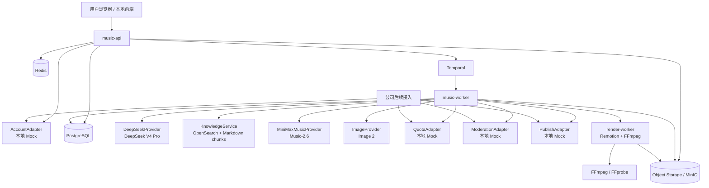
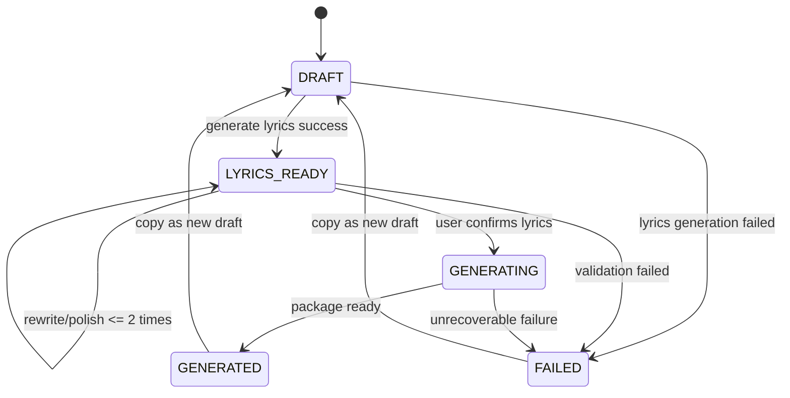

# 燕云 AI 作曲平台技术方案设计 v0.1

## 0. 文档信息

| 项目 | 内容 |
|---|---|
| 文档名称 | 燕云 AI 作曲平台技术方案设计 |
| 文档版本 | v0.1 |
| 文档日期 | 2026-06-03 |
| 输入文档 | 《燕云 AI 作曲平台 PRD v0.2》 |
| 目标阶段 | 本地完整跑通 → 公司服务器部署 → 公司系统接入 |
| 技术定位 | 正式商用级平台架构，不按临时活动脚手架设计 |
| 核心模型 | DeepSeek V4 Pro、MiniMax Music-2.6、Image 2 |
| 核心产物 | 16:9 MP4 歌词视频发布包 |
| 当前不包含 | 社区账号真实接入、审核真实接入、发布真实接入、任务权益真实接入、社区点赞收藏评论 |

---

## 1. 技术目标

本技术方案的目标是把 PRD v0.2 转换为可研发、可本地跑通、可部署、可接入公司系统的技术基线。

平台必须满足以下目标：

1. **完整链路可运行**：从用户输入故事或歌词，到写词、确认、出歌、封面、视频、发布包生成，能够在本地环境跑通。
2. **模型能力可插拔**：DeepSeek、MiniMax、Image 2 均通过 Provider Adapter 接入，不让业务层绑定具体 HTTP 协议。
3. **外部系统可后接**：账号、审核、任务权益、发布系统均通过 Adapter 预留，本地使用 Mock。
4. **生成任务可靠**：长耗时任务异步化，Worker 重启不丢任务，失败可重试、可追溯。
5. **素材资产可管理**：音频、封面、歌词时间轴、MP4、发布包等全部转存到对象存储并记录元数据。
6. **成本可观测**：每次 DeepSeek、MiniMax、Image 2、视频渲染调用都要记录耗时、状态、失败原因和成本字段。
7. **正式商用可扩展**：架构按平台能力设计，后续可增加活动包装、9:16 模板、ASR 歌词对齐、更多模型供应商。

---

## 2. 关键技术结论

### 2.1 后端主栈

推荐主栈：

```text
Java 21
Spring Boot 3.x
Gradle Kotlin DSL
PostgreSQL 16
Redis 7
Temporal
S3-compatible Object Storage，本地使用 MinIO
OpenSearch，本地用于燕云 Markdown 语料检索
FFmpeg / FFprobe
Node.js 22 + Remotion，用于高质量歌词视频渲染
Docker Compose，本地集成环境
OpenTelemetry + Prometheus + Grafana，观测预留
```

### 2.2 为什么不是单一 Java 服务完成所有事情

主业务、状态机、数据库、任务流转适合 Java/Spring Boot；但歌词视频模板、动态封面、字幕布局、频谱动效等更适合使用前端式渲染技术。

因此采用：

```text
Java 负责业务、任务、数据、Provider 调用、对象存储
Node.js + Remotion 负责 MP4 模板渲染
FFmpeg/FFprobe 负责音视频转码、探测、合成底层能力
```

这样比纯 FFmpeg filter 更容易做出稳定可维护的歌词视频模板，也比把全部逻辑写在 Node 服务里更适合长期业务平台。

### 2.3 服务形态

第一阶段采用 **模块化单体 + 独立 Worker + 独立渲染 Worker**。

不是一开始拆成十几个微服务，但代码边界按未来可拆分设计。

```text
music-api              用户 API、配置 API、发布包 API
music-worker           Temporal Worker，执行写词、出歌、封面、视频编排
render-worker          Remotion + FFmpeg，生成 MP4
knowledge-indexer      Markdown 语料库索引命令或一次性任务
PostgreSQL             业务数据库
Redis                  缓存、限流、幂等辅助
Temporal               长任务工作流
MinIO/S3               素材对象存储
OpenSearch             燕云语料检索
```

---

## 3. 总体架构



### 3.1 核心链路

```text
创建草稿
  ↓
DeepSeek + 燕云语料库生成歌词和歌曲方案
  ↓
用户确认歌词
  ↓
锁定权益
  ↓
MiniMax Music-2.6 生成歌曲
  ↓
音频转存和基础质检
  ↓
Image 2 生成封面，失败时默认封面兜底
  ↓
构建句级歌词时间轴
  ↓
render-worker 合成 16:9 MP4
  ↓
生成发布包
  ↓
外部发布系统后续获取发布包
```

---

## 4. 工程仓库结构

推荐仓库名：

```text
yanyun-ai-music-platform
```

目录结构：

```text
yanyun-ai-music-platform/
  apps/
    music-api/                 # Spring Boot API 应用
    music-worker/              # Spring Boot Temporal Worker 应用
    render-worker/             # Node.js + Remotion 渲染应用
    knowledge-indexer/         # Markdown 语料入库/索引命令，可 Java CLI 或 Spring profile

  modules/
    common/                    # 通用类型、错误码、工具、审计、时间、ID
    auth/                      # AccountAdapter、MockAccountAdapter
    quota/                     # QuotaAdapter、MockQuotaAdapter
    moderation/                # ModerationAdapter、MockModerationAdapter
    publish/                   # PublishAdapter、MockPublishAdapter
    work-domain/               # Work 聚合、状态机、领域服务
    lyrics/                    # 歌词生成、续写、润色、质量评分
    knowledge/                 # Markdown 语料检索、语料版本、chunk 管理
    prompt/                    # Prompt 模板、Prompt Builder、版本管理
    minimax/                   # MiniMax Music Provider
    deepseek/                  # DeepSeek Provider
    image2/                    # Image 2 Provider
    media/                     # 音频探测、质检、时间轴、文件元数据
    storage/                   # S3/MinIO、签名 URL、对象 Key 规范
    workflow/                  # Temporal Workflow 和 Activity 定义
    config-center/             # 平台配置、模型开关、降级开关
    observability/             # 指标、日志、trace 辅助

  database/
    migrations/                # Flyway SQL
    jooq/                      # jOOQ 生成配置

  deploy/
    docker-compose.yml
    docker/
      music-api.Dockerfile
      music-worker.Dockerfile
      render-worker.Dockerfile
    helm/                      # 公司服务器/K8s 阶段预留

  docs/
    prd/
    tech-design/
    api/
    adr/
    runbook/

  knowledge-base/              # 本地 Markdown 语料库样例目录，不放保密生产语料
    worldview.md
    locations.md
    characters.md
    plot_events.md
    lyric_style_guide.md
    forbidden_claims.md

  AGENTS.md
  README.md
```

### 4.1 模块化原则

1. `apps/*` 只负责应用启动、依赖装配、HTTP/Worker 入口。
2. `modules/*` 才放业务逻辑。
3. Provider 模块只暴露平台内部接口，不泄露供应商请求体到业务域。
4. Adapter 模块只定义后续接入边界，本地先 Mock。
5. Video Renderer 独立为 Node 应用，但它不直接访问数据库，只通过任务输入 JSON 和对象存储工作。

---

## 5. 核心领域模型

### 5.1 Work 聚合

`Work` 是平台内部最重要的聚合，表示一首歌从草稿到成品的完整生命周期。

```text
Work
  ├── InputSnapshot        用户输入快照
  ├── LyricsDraft          歌词草案和歌曲方案
  ├── GenerationJob        当前或最近一次生成任务
  ├── MediaAssets          音频、封面、视频、时间轴
  ├── PublishPackage       发布包
  ├── QuotaTransaction     权益锁定/扣减/释放记录
  └── ProviderCallRecords  模型调用记录
```

### 5.2 Work 状态

```text
DRAFT          草稿，已有用户输入，但未形成可确认歌词
LYRICS_READY   歌词和歌曲方案已生成，等待用户确认
GENERATING     用户确认出歌，正在生成音频、封面、视频
GENERATED      发布包已生成
FAILED         生成失败
```

### 5.3 生成阶段

```text
NONE
LYRICS_PREPARING
MUSIC_GENERATING
AUDIO_INGESTING
AUDIO_CHECKING
COVER_GENERATING
TIMELINE_BUILDING
VIDEO_RENDERING
PACKAGE_BUILDING
COMPLETED
FAILED
```

### 5.4 创作模式

```text
INSPIRATION_TO_SONG       灵感成歌
LYRICS_TO_SONG            填词成歌
AI_LYRICS_TO_SONG         AI 写词 / 续写 / 润色后出歌
```

### 5.5 歌曲篇幅

```text
SHORT       短篇
STANDARD    标准，默认
LONG        长篇
```

产品不承诺精确秒级时长。技术层通过歌词结构和 Prompt 影响模型输出，并记录实际时长。

---

## 6. 状态机设计

### 6.1 主状态机



### 6.2 失败处理原则

1. 歌词生成失败：不进入出歌，不锁定权益。
2. MiniMax 出歌失败：自动重试 1 次，仍失败则释放权益并标记失败。
3. 音频下载失败：若 MiniMax 返回 URL，尝试重新下载；超过重试上限后失败。
4. 音频质检失败：标记失败，释放权益。
5. Image 2 失败：默认封面兜底，不阻断整体生成。
6. 视频渲染失败：可单独重试，不重新出歌，不重复扣权益。
7. 发布包 URL 过期：重新签发，不改变 Work 状态。

---

## 7. 工作流设计

采用 Temporal 管理长任务。原因：

1. 模型调用和视频渲染耗时长。
2. 任务需要跨多个外部系统和对象存储。
3. 需要可恢复、可重试、可追踪。
4. Redis Queue 或 Kafka 需要额外自研大量状态机和补偿逻辑。

### 7.1 LyricsPreparationWorkflow

用于灵感成歌、AI 写词、填词结构化。

```text
Input: work_id, creation_mode, user_input, optional controls

Steps:
1. Load work
2. Input validation
3. ModerationAdapter.preCheck，当前本地 MockAllow
4. KnowledgeService.retrieve
5. DeepSeekProvider.generateLyricsOrStructure
6. LyricsQualityEvaluator.evaluate
7. If score below threshold: auto rewrite once
8. Persist lyrics draft
9. Update work status to LYRICS_READY
```

重试策略：

| Activity | 重试 |
|---|---:|
| Knowledge retrieval | 2 次 |
| DeepSeek call | 1 次 |
| JSON parse / repair | 1 次 |
| Persistence | 依赖事务，不做业务重试 |

### 7.2 SongProductionWorkflow

用户确认歌词后启动。

```text
Input: work_id

Steps:
1. Load work and validate status = LYRICS_READY
2. QuotaAdapter.lock
3. ModerationAdapter.preMusicGeneration，当前本地 MockAllow
4. Build MiniMax prompt
5. MiniMaxMusicProvider.generateSong
6. Ingest audio: url download or hex decode
7. Store raw audio
8. AudioQualityChecker.probe
9. If audio invalid: retry MiniMax once
10. QuotaAdapter.commit，成功出歌后扣减权益
11. ImageProvider.generateCover
12. If Image 2 failed: use default cover
13. Build lyric timeline
14. RenderWorker.renderVideo
15. Store MP4 and metadata
16. Build publish package
17. Update work status to GENERATED
```

补偿策略：

| 失败点 | 补偿 |
|---|---|
| Quota lock 后、出歌前失败 | release quota |
| MiniMax 失败 | retry once；仍失败 release quota |
| 音频质检失败 | retry MiniMax once；仍失败 release quota |
| 封面失败 | default cover fallback |
| 视频失败 | keep audio and cover；status FAILED；allow rerender |
| package build 失败 | retry package build，不重新出歌 |

### 7.3 CoverRegenerationWorkflow

用户对封面不满意时触发。

```text
Input: work_id

Steps:
1. Validate work status = GENERATED or GENERATING with audio ready
2. Check cover regenerate count <= 1
3. ImageProvider.generateCover
4. Store new cover
5. RenderWorker.renderVideo with new cover
6. Update publish package
```

### 7.4 VideoRerenderWorkflow

视频渲染失败或发布系统需要重新导出时触发。

```text
Input: work_id, template_id, aspect_ratio

Steps:
1. Load audio, cover, lyrics timeline
2. RenderWorker.renderVideo
3. Store new MP4
4. Refresh publish package
```

当前默认只支持 16:9，9:16 作为模板预留。

---

## 8. Provider 与 Adapter 设计

### 8.1 Provider 与 Adapter 区别

```text
Provider：平台主动调用的模型或基础能力供应商，例如 DeepSeek、MiniMax、Image 2、对象存储。
Adapter：公司系统接入边界，例如账号、审核、权益、发布。
```

### 8.2 DeepSeekProvider

职责：

1. 用户意图理解。
2. 燕云语料整合。
3. 歌词生成、续写、润色。
4. 歌曲结构整理。
5. MiniMax prompt 生成。
6. Image 2 cover prompt seed 生成。
7. JSON 结构化输出。

内部接口：

```java
public interface LyricsProvider {
    LyricsGenerationResult generateLyrics(LyricsGenerationCommand command);
    LyricsPolishResult polishLyrics(LyricsPolishCommand command);
    LyricsStructureResult structureUserLyrics(LyricsStructureCommand command);
}
```

实现：

```text
DeepSeekLyricsProvider
FakeLyricsProvider，本地无 API Key 时使用
```

### 8.3 MiniMaxMusicProvider

职责：

1. 调用 MiniMax Music-2.6。
2. 传入歌词和音乐 Prompt。
3. 控制音频输出设置。
4. 处理 URL 或 hex 返回。
5. 记录 trace_id、extra_info、错误码。
6. 不开放 cover/reference audio 能力。

内部接口：

```java
public interface MusicProvider {
    MusicGenerationResult generateSong(MusicGenerationCommand command);
}
```

请求策略：

```text
model = music-2.6
is_instrumental = false
lyrics_optimizer = false
output_format = url，若网络/安全要求不允许外链，则切 hex
audio_setting.sample_rate = 44100
audio_setting.bitrate = 256000
audio_setting.format = mp3
```

说明：MiniMax Music Generation API 支持 prompt、lyrics、audio_setting、output_format、lyrics_optimizer 和 is_instrumental 等字段。平台不开放纯音乐和 Cover 能力。

### 8.4 ImageProvider

职责：

1. 调用 Image 2 生成 16:9 专辑封面。
2. 使用平台预设 Prompt 模板约束燕云调性。
3. 默认生成 1 张。
4. 失败时返回可判定错误，供默认封面兜底。

内部接口：

```java
public interface ImageProvider {
    CoverGenerationResult generateCover(CoverGenerationCommand command);
}
```

实现：

```text
Image2Provider，公司 Image 2 API 确认后实现
FakeImageProvider，本地无 API Key 时生成默认图片
```

### 8.5 AccountAdapter

当前本地实现：

```text
MockAccountAdapter
请求头 X-Mock-User-Id
请求头 X-Mock-User-Name
```

未来公司接入：

```java
public interface AccountAdapter {
    CurrentUser verify(String bearerToken);
}
```

### 8.6 QuotaAdapter

职责：

1. 查询权益。
2. 锁定权益。
3. 成功扣减。
4. 失败释放。

接口：

```java
public interface QuotaAdapter {
    QuotaLock lock(QuotaLockCommand command);
    void commit(String lockId);
    void release(String lockId, String reason);
}
```

本地策略：

```text
默认用户无限或配置额度
成功出歌才扣主权益
失败释放
```

### 8.7 ModerationAdapter

平台不实现审核逻辑，但保留调用点。

```java
public interface ModerationAdapter {
    ModerationResult preCheckUserInput(ModerationCommand command);
    ModerationResult preCheckLyrics(ModerationCommand command);
    ModerationResult preCheckPublishPackage(ModerationCommand command);
}
```

本地全部 MockAllow。

### 8.8 PublishAdapter

当前不主动发布，只提供发布包接口。PublishAdapter 作为未来推送型集成预留。

```java
public interface PublishAdapter {
    PublishHandoffResult handoff(PublishHandoffCommand command);
}
```

本阶段默认不调用，只维护 `publish_package` 和 `handoff_status`。

---

## 9. 燕云 Markdown 语料库技术方案

### 9.1 输入形态

本地目录：

```text
knowledge-base/
  worldview.md
  locations.md
  characters.md
  plot_events.md
  factions.md
  cultural_terms.md
  lyric_style_guide.md
  official_copy_examples.md
  forbidden_claims.md
  glossary.md
```

### 9.2 索引流程

```text
读取 Markdown 文件
  ↓
按标题层级切分 section
  ↓
按 token 长度切分 chunk
  ↓
提取 metadata：file、heading、tags、content_type、version
  ↓
写入 PostgreSQL knowledge_document / knowledge_chunk
  ↓
同步到 OpenSearch
```

### 9.3 检索策略

本地第一阶段采用：

```text
OpenSearch 中文检索 + 标签过滤 + Prompt Builder 重排
```

预留增强：

```text
EmbeddingProvider + 向量检索
Hybrid Search：关键词检索 + 向量检索 + LLM rerank
```

不在第一批代码里强依赖具体 Embedding 模型，避免模型能力未确认导致主链路卡住。

### 9.4 语料版本

每次索引生成一个 `kb_version`。

```text
kb_version = yanyun-kb-YYYYMMDD-HHMMSS-gitsha
```

每次 Work 必须记录：

```text
knowledge_base_version
retrieved_chunk_ids
retrieved_file_names
prompt_template_version
```

### 9.5 Prompt 上下文拼装

```text
System Prompt
  ↓
平台规则：只写燕云内容，不仿现实歌曲/歌手，不编造硬设定
  ↓
用户输入
  ↓
用户控制项：情绪、场景、风格、演唱倾向、篇幅
  ↓
检索到的语料 chunks
  ↓
歌词结构要求
  ↓
JSON 输出 schema
```

---

## 10. Prompt 模板设计

### 10.1 模板分类

| 模板 | 用途 |
|---|---|
| inspiration_to_lyrics | 灵感成歌：故事转歌词 |
| lyrics_polish | 润色歌词 |
| lyrics_continue | 续写歌词 |
| lyrics_structure | 用户歌词结构整理 |
| minimax_music_prompt | 生成 MiniMax 音乐 Prompt |
| cover_prompt | 生成 Image 2 封面 Prompt |
| video_title_card | 视频开头标题卡文案 |
| fallback_cover | 默认封面模板 |

### 10.2 模板版本

每个模板字段：

```text
id
name
type
version
content
enabled
created_by
created_at
updated_at
```

生成记录中保存：

```text
prompt_template_id
prompt_template_version
prompt_hash
```

### 10.3 Prompt 安全边界

Prompt Builder 必须前置加入：

```text
不模仿现实歌手、现实歌曲、厂牌、专辑、影视/游戏商业配乐
不使用用户要求的翻唱、复刻、参考音频
不编造燕云硬设定
不逐字复述官方长文案
只输出结构化 JSON
```

---

## 11. 歌词生成与确认技术流程

### 11.1 灵感成歌请求

```http
POST /api/v1/works/inspiration
```

请求体：

```json
{
  "story_input": "我想写一首清河雨夜，少年侠客与故人重逢，最后各自远行的歌。",
  "mood": "悲壮",
  "scene": "清河雨夜",
  "relationship": "故人重逢",
  "music_style": "国风流行，也可以有一点摇滚推进感",
  "vocal_preference": "不指定",
  "song_scope": "STANDARD"
}
```

返回：

```json
{
  "work_id": "wrk_xxx",
  "status": "DRAFT",
  "lyrics_job_id": "job_xxx"
}
```

说明：歌词生成可以异步，前端轮询 work 状态。若技术压测后 P95 可接受，也可以做同步返回，但接口设计保持异步兼容。

### 11.2 查询作品

```http
GET /api/v1/works/{work_id}
```

当状态为 `LYRICS_READY` 时返回：

```json
{
  "work_id": "wrk_xxx",
  "status": "LYRICS_READY",
  "song_title": "夜渡清河",
  "song_summary": "一首关于雨夜重逢与江湖别离的叙事歌曲",
  "lyrics": "[Verse 1]\n...",
  "music_prompt_preview": "武侠叙事、悲壮、国风流行...",
  "quality_score": 0.86,
  "polish_remaining": 2
}
```

### 11.3 歌词改词

```http
POST /api/v1/works/{work_id}/lyrics/polish
```

请求体：

```json
{
  "instruction": "更苍凉一点，副歌更有记忆点"
}
```

限制：每个草稿最多 2 次。

### 11.4 用户确认出歌

```http
POST /api/v1/works/{work_id}/confirm
```

行为：

```text
校验 status = LYRICS_READY
校验歌词长度和结构
启动 SongProductionWorkflow
状态改为 GENERATING
```

---

## 12. MiniMax 出歌技术流程

### 12.1 请求构造

平台内部命令：

```json
{
  "model": "music-2.6",
  "prompt": "Chinese wuxia pop song, emotional, cinematic, ...",
  "lyrics": "[Verse 1]\n...",
  "is_instrumental": false,
  "lyrics_optimizer": false,
  "audio_setting": {
    "sample_rate": 44100,
    "bitrate": 256000,
    "format": "mp3"
  },
  "output_format": "url"
}
```

### 12.2 输出处理

若 `output_format=url`：

```text
读取返回 URL
  ↓
立即下载到本地临时文件
  ↓
校验 HTTP 状态、文件大小、checksum
  ↓
上传对象存储
  ↓
删除本地临时文件
```

若 `output_format=hex`：

```text
hex decode
  ↓
写入本地临时文件
  ↓
上传对象存储
```

### 12.3 音频质检

使用 FFprobe + FFmpeg：

```text
检查能否解码
获取 duration、sample_rate、channels、bitrate
检测文件大小
检测静音片段
检测峰值过高
检测视频渲染可用性
```

初期不做复杂 ASR 歌词对齐，但预留 `AudioAnalysisProvider`。

### 12.4 MiniMax 错误码归一

平台统一错误：

```text
PROVIDER_TIMEOUT
PROVIDER_RATE_LIMITED
PROVIDER_AUTH_FAILED
PROVIDER_BAD_REQUEST
PROVIDER_INTERNAL_ERROR
PROVIDER_INVALID_RESPONSE
AUDIO_DOWNLOAD_FAILED
AUDIO_DECODE_FAILED
AUDIO_QUALITY_FAILED
```

---

## 13. 封面生成技术流程

### 13.1 封面 Prompt 输入

```text
song_title
song_summary
lyrics_highlights
mood
scene
cover_prompt_seed
platform_cover_style_template
```

### 13.2 Image 2 调用

接口通过 `ImageProvider` 抽象，当前不在技术方案中绑定具体 HTTP 请求体，因为 Image 2 API 细节由公司开发确认。

平台约束：

```text
aspect_ratio = 16:9
n = 1
风格：燕云世界、专辑封面、不可出现现代 logo/二维码/真实人物肖像
输出：图片 URL 或二进制，必须转存对象存储
```

### 13.3 默认封面兜底

默认封面可以由本地静态模板生成：

```text
背景：燕云主题纹理图
中间：歌名
下方：作品编号
```

实现方式：

```text
render-worker 生成静态 cover.png
或 Java 使用模板图 + 字体渲染生成
```

建议由 render-worker 统一处理，保证字体与视频模板一致。

---

## 14. 歌词时间轴技术方案

### 14.1 首期策略

首期不做逐字对齐，做句级时间轴。

输入：

```text
结构化歌词
音频实际时长
视频标题卡时长
视频结尾卡时长
歌曲 section 类型
```

输出：

```json
{
  "version": "timeline-v1",
  "duration_ms": 184000,
  "lines": [
    {
      "index": 0,
      "section": "Verse 1",
      "text": "我从清河过，夜雨落满舟",
      "start_ms": 3000,
      "end_ms": 8600
    }
  ]
}
```

### 14.2 时间分配算法

1. 解析歌词 section。
2. 去除 `[Intro]`、`[Inst]` 等无歌词段，但保留时间权重。
3. 按 section 类型分配权重。
4. section 内按行字符数和行数分配时间。
5. 每句最短展示时间不低于配置阈值。
6. 最后一行结束时间不超过音频结束前配置阈值。

默认权重示例：

| Section | 权重策略 |
|---|---|
| Intro | 固定 3–8 秒，视总时长配置 |
| Verse | 按行数和字符数分配 |
| Chorus | 比 Verse 稍高权重，保证副歌可读 |
| Bridge | 按行数分配 |
| Outro | 固定 3–8 秒 |
| Inst/Solo | 无字幕展示，只展示封面和频谱 |

### 14.3 未来升级

预留：

```text
ASRProvider
ForcedAlignmentProvider
WordLevelTimeline
```

未来可升级为逐字高亮，但不影响首期接口。

---

## 15. 视频渲染技术方案

### 15.1 render-worker 技术栈

```text
Node.js 22
TypeScript
Remotion
FFmpeg
FFprobe
```

### 15.2 渲染输入

`render-worker` 接收 JSON：

```json
{
  "render_job_id": "rj_xxx",
  "template_id": "lyric-video-16x9-v1",
  "output": {
    "width": 1920,
    "height": 1080,
    "fps": 30,
    "format": "mp4"
  },
  "assets": {
    "audio_url": "s3://bucket/key/audio.mp3",
    "cover_url": "s3://bucket/key/cover.png",
    "timeline_url": "s3://bucket/key/timeline.json"
  },
  "metadata": {
    "song_title": "夜渡清河",
    "author_name": "MockUser",
    "work_code": "YYM-20260603-XXXX"
  }
}
```

### 15.3 渲染输出

```json
{
  "render_job_id": "rj_xxx",
  "status": "SUCCESS",
  "video_object_key": "works/2026/06/03/wrk_xxx/video.mp4",
  "duration_ms": 184000,
  "width": 1920,
  "height": 1080,
  "file_size_bytes": 12345678,
  "checksum": "sha256:..."
}
```

### 15.4 模板要求

默认模板：`lyric-video-16x9-v1`

元素：

```text
封面图主体
封面虚化背景
标题卡 2–3 秒
句级歌词字幕
轻动态背景
音频频谱或波形
结尾卡 1–2 秒
```

备用模板：`cover-video-16x9-v1`

触发：

```text
字幕时间轴失败
歌词解析失败
字幕渲染失败
运营关闭字幕
```

### 15.5 渲染方式

推荐：

```text
Remotion 渲染画面层
FFmpeg 合成音频、编码 H.264/AAC
输出 MP4
```

### 15.6 字体与版权

生产环境字体必须由公司确认授权。仓库不应提交未授权字体文件。

本地开发可使用系统字体或公司提供的可用字体路径配置。

---

## 16. 对象存储设计

### 16.1 存储类型

```text
raw_audio          MiniMax 原始音频转存
processed_audio    标准化音频，可选
cover_image        专辑封面
lyrics_text        歌词文本
lyrics_timeline    歌词时间轴 JSON
video_mp4          成品视频
render_input       渲染任务输入快照
publish_package    发布包 JSON 快照
```

### 16.2 Object Key 规范

```text
yanyun-ai-music/{env}/{yyyy}/{mm}/{dd}/{work_id}/audio/raw.mp3
yanyun-ai-music/{env}/{yyyy}/{mm}/{dd}/{work_id}/cover/cover-v1.png
yanyun-ai-music/{env}/{yyyy}/{mm}/{dd}/{work_id}/lyrics/lyrics.txt
yanyun-ai-music/{env}/{yyyy}/{mm}/{dd}/{work_id}/lyrics/timeline-v1.json
yanyun-ai-music/{env}/{yyyy}/{mm}/{dd}/{work_id}/video/video-16x9-v1.mp4
yanyun-ai-music/{env}/{yyyy}/{mm}/{dd}/{work_id}/package/publish-package.json
```

### 16.3 签名 URL

发布包接口返回签名 URL。

要求：

```text
URL 有过期时间
过期后可 refresh
GET publish-package 时可按需签发
mark-fetched 只记录交接，不代表社区发布成功
```

---

## 17. 数据库设计

使用 PostgreSQL + Flyway + jOOQ。

### 17.1 works

```sql
CREATE TABLE works (
  id                    UUID PRIMARY KEY,
  work_code             VARCHAR(64) NOT NULL UNIQUE,
  user_id               VARCHAR(128) NOT NULL,
  user_name_snapshot    VARCHAR(128),
  creation_mode         VARCHAR(64) NOT NULL,
  status                VARCHAR(32) NOT NULL,
  generation_stage      VARCHAR(64) NOT NULL DEFAULT 'NONE',
  song_scope            VARCHAR(32) NOT NULL DEFAULT 'STANDARD',
  song_title            VARCHAR(256),
  song_summary          TEXT,
  polish_used_count     INTEGER NOT NULL DEFAULT 0,
  cover_regen_count     INTEGER NOT NULL DEFAULT 0,
  parent_work_id        UUID,
  failure_code          VARCHAR(128),
  failure_message       TEXT,
  created_at            TIMESTAMPTZ NOT NULL,
  updated_at            TIMESTAMPTZ NOT NULL,
  generated_at          TIMESTAMPTZ
);
```

### 17.2 work_inputs

```sql
CREATE TABLE work_inputs (
  id                    UUID PRIMARY KEY,
  work_id               UUID NOT NULL REFERENCES works(id),
  story_input            TEXT,
  lyrics_input           TEXT,
  mood                  VARCHAR(128),
  scene                 VARCHAR(256),
  relationship          VARCHAR(256),
  music_style           TEXT,
  vocal_preference      VARCHAR(64),
  input_snapshot_json   JSONB NOT NULL,
  created_at            TIMESTAMPTZ NOT NULL
);
```

### 17.3 lyrics_drafts

```sql
CREATE TABLE lyrics_drafts (
  id                         UUID PRIMARY KEY,
  work_id                    UUID NOT NULL REFERENCES works(id),
  version_no                 INTEGER NOT NULL,
  song_title                 VARCHAR(256) NOT NULL,
  song_summary               TEXT,
  lyrics_text                TEXT NOT NULL,
  structured_lyrics_json     JSONB NOT NULL,
  sections_json              JSONB,
  music_prompt               TEXT NOT NULL,
  cover_prompt_seed          TEXT,
  quality_score              NUMERIC(5, 4),
  risk_notes_json            JSONB,
  yanyun_references_json     JSONB,
  knowledge_base_version     VARCHAR(128),
  prompt_template_versions   JSONB,
  created_at                 TIMESTAMPTZ NOT NULL,
  UNIQUE (work_id, version_no)
);
```

### 17.4 generation_jobs

```sql
CREATE TABLE generation_jobs (
  id                    UUID PRIMARY KEY,
  work_id               UUID NOT NULL REFERENCES works(id),
  workflow_id           VARCHAR(256),
  workflow_run_id       VARCHAR(256),
  job_type              VARCHAR(64) NOT NULL,
  status                VARCHAR(32) NOT NULL,
  stage                 VARCHAR(64),
  retry_count           INTEGER NOT NULL DEFAULT 0,
  started_at            TIMESTAMPTZ,
  completed_at          TIMESTAMPTZ,
  failure_code          VARCHAR(128),
  failure_message       TEXT,
  created_at            TIMESTAMPTZ NOT NULL,
  updated_at            TIMESTAMPTZ NOT NULL
);
```

### 17.5 media_assets

```sql
CREATE TABLE media_assets (
  id                    UUID PRIMARY KEY,
  work_id               UUID NOT NULL REFERENCES works(id),
  asset_type            VARCHAR(64) NOT NULL,
  object_key            TEXT NOT NULL,
  mime_type             VARCHAR(128),
  file_size_bytes       BIGINT,
  checksum              VARCHAR(256),
  width                 INTEGER,
  height                INTEGER,
  duration_ms           INTEGER,
  sample_rate           INTEGER,
  bitrate               INTEGER,
  metadata_json         JSONB,
  created_at            TIMESTAMPTZ NOT NULL
);
```

### 17.6 publish_packages

```sql
CREATE TABLE publish_packages (
  id                    UUID PRIMARY KEY,
  work_id               UUID NOT NULL REFERENCES works(id),
  package_status        VARCHAR(64) NOT NULL,
  package_json          JSONB NOT NULL,
  package_object_key    TEXT,
  fetched_at            TIMESTAMPTZ,
  last_url_refreshed_at TIMESTAMPTZ,
  created_at            TIMESTAMPTZ NOT NULL,
  updated_at            TIMESTAMPTZ NOT NULL
);
```

### 17.7 provider_calls

```sql
CREATE TABLE provider_calls (
  id                    UUID PRIMARY KEY,
  work_id               UUID REFERENCES works(id),
  job_id                UUID REFERENCES generation_jobs(id),
  provider              VARCHAR(64) NOT NULL,
  operation             VARCHAR(64) NOT NULL,
  model_name            VARCHAR(128),
  request_hash          VARCHAR(256),
  prompt_hash           VARCHAR(256),
  provider_trace_id     VARCHAR(256),
  status                VARCHAR(32) NOT NULL,
  latency_ms            INTEGER,
  cost_units            NUMERIC(18, 6),
  error_code            VARCHAR(128),
  error_message         TEXT,
  created_at            TIMESTAMPTZ NOT NULL
);
```

### 17.8 quota_transactions

```sql
CREATE TABLE quota_transactions (
  id                    UUID PRIMARY KEY,
  work_id               UUID NOT NULL REFERENCES works(id),
  user_id               VARCHAR(128) NOT NULL,
  external_lock_id      VARCHAR(256),
  action                VARCHAR(64) NOT NULL,
  status                VARCHAR(32) NOT NULL,
  amount                INTEGER NOT NULL DEFAULT 1,
  reason                TEXT,
  created_at            TIMESTAMPTZ NOT NULL,
  updated_at            TIMESTAMPTZ NOT NULL
);
```

### 17.9 knowledge tables

```sql
CREATE TABLE knowledge_documents (
  id                    UUID PRIMARY KEY,
  kb_version            VARCHAR(128) NOT NULL,
  file_path             TEXT NOT NULL,
  title                 TEXT,
  content_hash          VARCHAR(256) NOT NULL,
  metadata_json         JSONB,
  created_at            TIMESTAMPTZ NOT NULL
);

CREATE TABLE knowledge_chunks (
  id                    UUID PRIMARY KEY,
  document_id           UUID NOT NULL REFERENCES knowledge_documents(id),
  kb_version            VARCHAR(128) NOT NULL,
  chunk_index           INTEGER NOT NULL,
  heading_path          TEXT,
  content               TEXT NOT NULL,
  tags_json             JSONB,
  token_count           INTEGER,
  created_at            TIMESTAMPTZ NOT NULL
);
```

### 17.10 prompt_templates

```sql
CREATE TABLE prompt_templates (
  id                    UUID PRIMARY KEY,
  template_key          VARCHAR(128) NOT NULL,
  version               INTEGER NOT NULL,
  content               TEXT NOT NULL,
  enabled               BOOLEAN NOT NULL DEFAULT true,
  metadata_json         JSONB,
  created_at            TIMESTAMPTZ NOT NULL,
  updated_at            TIMESTAMPTZ NOT NULL,
  UNIQUE (template_key, version)
);
```

### 17.11 system_configs

```sql
CREATE TABLE system_configs (
  config_key            VARCHAR(128) PRIMARY KEY,
  config_value          JSONB NOT NULL,
  updated_by            VARCHAR(128),
  updated_at            TIMESTAMPTZ NOT NULL
);
```

### 17.12 idempotency_keys

```sql
CREATE TABLE idempotency_keys (
  id                    UUID PRIMARY KEY,
  user_id               VARCHAR(128) NOT NULL,
  idempotency_key       VARCHAR(256) NOT NULL,
  operation             VARCHAR(128) NOT NULL,
  response_json         JSONB,
  created_at            TIMESTAMPTZ NOT NULL,
  UNIQUE (user_id, idempotency_key, operation)
);
```

---

## 18. API 设计草案

接口路径为 v0.1 草案，后续在 OpenAPI 文档中冻结。

### 18.1 用户身份

```http
GET /api/v1/me
```

本地 Mock 返回：

```json
{
  "user_id": "mock_user_001",
  "nickname": "MockUser",
  "avatar_url": null,
  "roles": ["USER"]
}
```

### 18.2 灵感成歌

```http
POST /api/v1/works/inspiration
```

Header：

```text
Idempotency-Key: uuid
```

返回：

```json
{
  "work_id": "uuid",
  "work_code": "YYM-20260603-XXXX",
  "status": "DRAFT",
  "job_id": "uuid"
}
```

### 18.3 填词成歌

```http
POST /api/v1/works/lyrics
```

返回同上。

### 18.4 查询作品

```http
GET /api/v1/works/{work_id}
```

返回包含状态、歌词草案、生成阶段、成品资源。

### 18.5 作品列表

```http
GET /api/v1/works?status=GENERATED&page=1&page_size=20
```

只返回当前用户作品。本地 Mock 用户隔离。

### 18.6 歌词润色

```http
POST /api/v1/works/{work_id}/lyrics/polish
```

请求：

```json
{
  "instruction": "副歌更有记忆点，整体更苍凉"
}
```

### 18.7 歌词续写

```http
POST /api/v1/works/{work_id}/lyrics/continue
```

### 18.8 确认出歌

```http
POST /api/v1/works/{work_id}/confirm
```

返回：

```json
{
  "work_id": "uuid",
  "status": "GENERATING",
  "job_id": "uuid"
}
```

### 18.9 封面重生

```http
POST /api/v1/works/{work_id}/cover/regenerate
```

### 18.10 视频重渲染

```http
POST /api/v1/works/{work_id}/video/rerender
```

### 18.11 获取发布包

```http
GET /api/v1/works/{work_id}/publish-package
```

### 18.12 标记发布包已获取

```http
POST /api/v1/works/{work_id}/publish-package/mark-fetched
```

### 18.13 重新签发发布包 URL

```http
POST /api/v1/works/{work_id}/publish-package/refresh-url
```

### 18.14 配置后台 API

第一阶段可以先做内部 API，不做复杂前端后台。

```http
GET /admin/v1/configs
PUT /admin/v1/configs/{config_key}
GET /admin/v1/prompt-templates
POST /admin/v1/prompt-templates
PUT /admin/v1/prompt-templates/{id}/enable
POST /admin/v1/knowledge/index
GET /admin/v1/works/{work_id}/debug
```

---

## 19. 错误码设计

统一错误响应：

```json
{
  "error": {
    "code": "MINIMAX_TIMEOUT",
    "message": "歌曲生成较慢，请稍后重试",
    "request_id": "req_xxx",
    "work_id": "wrk_xxx"
  }
}
```

错误码分类：

```text
INPUT_INVALID
INPUT_TOO_SHORT
INPUT_TOO_LONG
INPUT_NOT_YANYUN_RELATED
LYRICS_LIMIT_EXCEEDED
LYRICS_QUALITY_LOW
POLISH_LIMIT_EXCEEDED
WORK_STATUS_INVALID
QUOTA_NOT_ENOUGH
QUOTA_LOCK_FAILED
DEEPSEEK_TIMEOUT
DEEPSEEK_INVALID_RESPONSE
MINIMAX_TIMEOUT
MINIMAX_RATE_LIMITED
MINIMAX_INVALID_RESPONSE
AUDIO_DOWNLOAD_FAILED
AUDIO_DECODE_FAILED
AUDIO_QUALITY_FAILED
IMAGE2_TIMEOUT
IMAGE2_FAILED
VIDEO_RENDER_FAILED
PACKAGE_NOT_READY
PACKAGE_URL_EXPIRED
INTERNAL_ERROR
```

---

## 20. 幂等、并发与一致性

### 20.1 幂等

必须使用 `Idempotency-Key` 的操作：

```text
创建灵感作品
创建填词作品
歌词润色
确认出歌
封面重生
视频重渲染
刷新发布包 URL
```

### 20.2 并发控制

同一 Work：

```text
同一时间只能有一个活跃生成类 Workflow
LYRICS_READY 时不能并发 polish 和 confirm
GENERATING 时不能再次 confirm
GENERATED 时不能覆盖原作品
```

实现方式：

```text
数据库乐观锁 version 字段，或 SELECT FOR UPDATE
Temporal workflow_id 按 work_id 固定命名
Redis 分布式锁只作为辅助，不作为唯一一致性保障
```

### 20.3 事务边界

1. API 创建 Work 与写入初始输入同事务。
2. 启动 Temporal workflow 与数据库事务之间使用 Outbox 或状态补偿。
3. Provider 调用结果先落 provider_calls，再更新 work 状态。
4. 对象存储成功后再写 media_assets。
5. 发布包 JSON 写入数据库，同时写对象存储快照。

---

## 21. 本地开发环境

### 21.1 docker-compose 组件

```text
postgres:16
redis:7
temporalio/auto-setup
minio
opensearch
prometheus
grafana，可选
music-api
music-worker
render-worker
```

### 21.2 环境变量

```text
APP_ENV=local
DATABASE_URL=jdbc:postgresql://postgres:5432/yanyun_music
REDIS_URL=redis://redis:6379
TEMPORAL_TARGET=temporal:7233
S3_ENDPOINT=http://minio:9000
S3_BUCKET=yanyun-ai-music-local
S3_ACCESS_KEY=minio
S3_SECRET_KEY=minio123
OPENSEARCH_URL=http://opensearch:9200
DEEPSEEK_API_KEY=optional
MINIMAX_API_KEY=optional
IMAGE2_API_KEY=optional
PROVIDER_MODE=fake|real|mixed
```

### 21.3 Provider 模式

```text
fake：全部使用假模型，适合无 Key 本地开发
mixed：可单独启用 DeepSeek/MiniMax/Image2
real：全部真实模型，适合联调和压测
```

### 21.4 本地跑通顺序

```text
1. docker compose up 基础依赖
2. 执行 Flyway migration
3. 启动 knowledge-indexer 导入 Markdown 语料
4. 启动 music-api
5. 启动 music-worker
6. 启动 render-worker
7. 使用 fake provider 完成端到端生成
8. 切换 MiniMax real provider 验证出歌
9. 切换 DeepSeek real provider 验证作词
10. 切换 Image2 real provider 验证封面
```

---

## 22. 可观测设计

### 22.1 Trace

每个请求生成：

```text
request_id
trace_id
work_id
job_id
workflow_id
provider_trace_id
```

需要贯穿：

```text
API → DB → Temporal → Worker → Provider → Storage → Renderer
```

### 22.2 Metrics

必须采集：

```text
lyrics_generation_latency_ms
music_generation_latency_ms
image_generation_latency_ms
video_render_latency_ms
end_to_end_generation_latency_ms
provider_success_total
provider_failure_total
work_status_total
workflow_failure_total
quota_lock_total
quota_release_total
storage_upload_latency_ms
render_queue_depth
```

### 22.3 日志

日志必须包含：

```text
request_id
work_id
job_id
stage
provider
error_code
latency_ms
```

日志不得包含：

```text
API Key
完整 Authorization header
长期明文保存的敏感个人信息
```

歌词和 Prompt 是否明文记录需要遵守公司数据规范。默认策略：数据库存业务必需内容，普通应用日志只记录 hash 和摘要。

---

## 23. 安全设计

### 23.1 Secret 管理

本地：`.env`，不入 Git。

公司服务器：接入公司 Secret 管理系统。

禁止：

```text
在代码中写死 API Key
在测试快照中保存真实 token
在日志中打印模型请求 Authorization
```

### 23.2 对象存储访问

```text
内部服务使用对象 Key
前端和发布接入方使用签名 URL
签名 URL 可配置过期时间
发布包 URL 可刷新
```

### 23.3 权限

本地阶段：

```text
Mock USER
Mock ADMIN
```

API 权限：

```text
用户只能查看自己的 Work
Admin 可查看 debug 和配置
发布包接口后续应支持系统级鉴权
```

---

## 24. 性能与容量设计

### 24.1 关键瓶颈

```text
MiniMax 出歌耗时和并发
Image 2 封面耗时和并发
MP4 渲染 CPU/内存/磁盘 IO
对象存储上传下载
OpenSearch 检索延迟
Temporal Worker 并发
```

### 24.2 并发策略

Worker 配置：

```text
lyrics worker concurrency: 可较高
music generation concurrency: 按 MiniMax RPM 限制
image generation concurrency: 按 Image 2 限制
render concurrency: 按 CPU 和内存限制
```

### 24.3 队列隔离

Temporal Task Queue：

```text
lyrics-task-queue
music-task-queue
image-task-queue
render-task-queue
package-task-queue
```

避免 MP4 渲染占满资源后影响歌词生成。

### 24.4 降级策略

```text
MiniMax 异常：关闭 confirm 出歌入口
DeepSeek 异常：关闭歌词润色/生成入口，保留已完成作品查看
Image 2 异常：默认封面兜底
Render 异常：生成音频和封面后标记视频失败，可稍后重渲染
OpenSearch 异常：使用基础 Prompt 或内置最小语料，不建议正式商用时启用
```

---

## 25. 测试方案

### 25.1 单元测试

```text
状态机流转
Prompt Builder
歌词结构解析
篇幅到歌词结构映射
时间轴生成算法
Object Key 生成
错误码映射
幂等逻辑
```

### 25.2 集成测试

使用 Testcontainers：

```text
PostgreSQL
Redis
MinIO
OpenSearch
```

Provider 使用 Mock HTTP Server，不在自动测试里调用真实模型。

### 25.3 工作流测试

```text
LyricsPreparationWorkflow 成功
LyricsPreparationWorkflow 低质量自动重写
SongProductionWorkflow 成功
MiniMax 失败自动重试
Image 2 失败默认封面兜底
Video render 失败可重试
Quota lock 后失败 release
```

### 25.4 端到端测试

```text
fake provider 端到端生成 MP4
真实 MiniMax 出歌联调
真实 DeepSeek 作词联调
真实 Image 2 封面联调
真实 render-worker 渲染联调
```

### 25.5 压测

至少准备：

```text
20 首短篇
20 首标准篇
20 首长篇
不同风格输入
不同歌词长度
MiniMax output_format=url 和 hex 对比
MP4 渲染并发 1/2/4/8 对比
```

记录：

```text
P50/P90/P95 端到端耗时
各 Provider 耗时
渲染耗时
失败率
平均文件大小
平均成本
```

---

## 26. 部署设计

### 26.1 本地

```text
Docker Compose
全部服务本地运行
Provider 可 fake/mixed/real
```

### 26.2 公司服务器第一阶段

```text
music-api: 2 副本起
music-worker: 2 副本起，按 task queue 可拆分
render-worker: 独立 CPU 资源池
PostgreSQL: 使用公司托管数据库或高可用实例
Redis: 公司托管或高可用实例
Temporal: 自建或公司基础设施
对象存储: 公司对象存储
OpenSearch: 公司托管或独立部署
```

### 26.3 K8s 资源建议

```text
music-api: CPU 1–2 core，内存 2–4GB
music-worker: CPU 2–4 core，内存 4–8GB
render-worker: CPU 4–8 core，内存 8–16GB，需本地临时磁盘
OpenSearch: 视语料规模调整
```

具体资源需要压测后调整。

---

## 27. Codex 开发拆分

### 27.1 第 1 批：仓库初始化

目标：搭好工程骨架，不写业务主链路。

交给 Codex：

```text
Create a multi-module Java 21 Spring Boot 3 project with Gradle Kotlin DSL.
Add apps/music-api and apps/music-worker.
Add modules/common, auth, quota, moderation, publish, work-domain, lyrics, knowledge, prompt, minimax, deepseek, image2, media, storage, workflow, config-center, observability.
Add apps/render-worker as Node.js 22 + TypeScript + Remotion scaffold.
Add Docker Compose with PostgreSQL, Redis, MinIO, Temporal, OpenSearch.
Add Flyway, jOOQ, JUnit 5, Testcontainers, springdoc-openapi, Spotless.
Add AGENTS.md with build/test/lint commands.
Do not implement business logic yet.
```

验收：

```text
./gradlew clean build 成功
render-worker npm test/build 成功
docker compose up 基础依赖可启动
music-api /health 返回 OK
music-worker 可连接 Temporal
```

### 27.2 第 2 批：数据库与领域状态机

```text
Implement Flyway migrations for works, work_inputs, lyrics_drafts, generation_jobs, media_assets, publish_packages, provider_calls, quota_transactions, knowledge tables, prompt_templates, system_configs, idempotency_keys.
Generate jOOQ classes.
Implement Work aggregate and status transition rules.
Add unit tests for valid and invalid transitions.
```

### 27.3 第 3 批：Mock Adapter 与基础 API

```text
Implement MockAccountAdapter, MockQuotaAdapter, MockModerationAdapter, MockPublishAdapter.
Implement GET /api/v1/me.
Implement POST /api/v1/works/inspiration, POST /api/v1/works/lyrics, GET /api/v1/works/{id}, GET /api/v1/works.
Use fake lyrics provider initially.
```

### 27.4 第 4 批：知识库索引与 DeepSeek Provider

```text
Implement Markdown knowledge indexer.
Index chunks into PostgreSQL and OpenSearch.
Implement KnowledgeService retrieve.
Implement DeepSeekProvider with JSON output parsing and repair.
Implement fake DeepSeek tests with MockWebServer.
```

### 27.5 第 5 批：歌词确认与改词

```text
Implement LyricsPreparationWorkflow.
Implement lyrics polish/continue APIs.
Enforce polish limit = 2.
Implement LyricsQualityEvaluator.
```

### 27.6 第 6 批：MiniMax 出歌

```text
Implement MiniMaxMusicProvider.
Support model music-2.6, lyrics, prompt, audio_setting, output_format=url/hex.
Implement audio ingest, download, checksum, S3 upload.
Implement FFprobe quality check.
Add provider error mapping and retry behavior.
```

### 27.7 第 7 批：Image 2 Provider 与封面兜底

```text
Implement ImageProvider interface.
Implement FakeImageProvider.
Implement Image2Provider after company API details are available.
Implement default cover generation fallback.
Implement cover regenerate limit = 1.
```

### 27.8 第 8 批：render-worker 与 MP4 生成

```text
Implement Remotion lyric-video-16x9-v1 template.
Implement cover-video-16x9-v1 fallback template.
Implement render job input JSON.
Implement FFmpeg H.264/AAC export.
Implement upload to MinIO/S3.
Add local sample render test.
```

### 27.9 第 9 批：SongProductionWorkflow 端到端

```text
Implement confirm API.
Implement SongProductionWorkflow with quota lock, MiniMax, audio check, cover, timeline, render, package build.
Implement failure compensation.
Implement GET publish-package, mark-fetched, refresh-url.
```

### 27.10 第 10 批：可观测、压测、上线准备

```text
Add OpenTelemetry traces.
Add Micrometer metrics.
Add admin debug endpoint.
Add runbook.
Add load-test scripts.
Add provider mode fake/mixed/real.
Add deployment docs.
```

---

## 28. AGENTS.md 初版建议

```md
# AGENTS.md

## Project
Yanyun AI Music Platform.

## Stack
- Java 21
- Spring Boot 3
- Gradle Kotlin DSL
- PostgreSQL 16
- Redis 7
- Temporal
- MinIO/S3
- OpenSearch
- Node.js 22 + TypeScript + Remotion for render-worker

## Build
./gradlew clean build

## Test
./gradlew test

## Formatting
./gradlew spotlessApply
./gradlew spotlessCheck

## Render worker
cd apps/render-worker
npm install
npm run build
npm test

## Rules
- Do not commit secrets.
- Do not call real DeepSeek, MiniMax, or Image 2 APIs in automated tests.
- Use fake providers or mocked HTTP servers for tests.
- Use Flyway for schema changes.
- Use jOOQ for database access.
- Keep Provider adapters isolated from domain logic.
- Keep external system integrations behind Adapter interfaces.
- Every behavior change must include tests.
- Do not introduce new dependencies without explaining why.
- Do not add unsupported features such as pure music, cover/reference audio, platform social interactions, or direct community publishing.
```

---

## 29. 技术风险与处理策略

| 风险 | 影响 | 处理策略 |
|---|---|---|
| MiniMax 出歌耗时不稳定 | 用户等待长、队列积压 | Temporal 异步、阶段提示、并发限流、压测后设置阈值 |
| MiniMax 输出 URL 过期 | 音频资产丢失 | 生成后立即下载并转存对象存储 |
| 歌词质量不稳定 | 用户不确认歌词、出歌浪费 | DeepSeek 结构化输出、质量评分、低质量自动重写 |
| 燕云语料检索不准 | 歌词跑偏或乱编 | 语料分层、OpenSearch 检索、命中 chunk 记录、Prompt 约束 |
| Image 2 封面跑偏 | 成品观感差 | 预设封面 Prompt、默认封面兜底、封面重生一次 |
| 字幕时间轴不准 | 视频质量下降 | 句级字幕、错位容忍、封面视频兜底、未来 ASR 对齐预留 |
| MP4 渲染资源吃紧 | 生成吞吐受限 | render-worker 独立资源池、task queue 隔离、并发配置 |
| 公司系统协议未定 | 接入延期 | Adapter + Mock，核心生产能力先独立完成 |
| 成本失控 | 正式商用风险 | QuotaAdapter、模型调用记录、生成成功才扣主要权益、开关降级 |

---

## 30. 下一步交付物

技术方案 v0.1 后，建议继续输出以下文档：

```text
1. OpenAPI 接口契约 v0.1
2. 数据库 ERD 与 Flyway migration v0.1
3. Temporal Workflow 详细设计 v0.1
4. Provider Adapter 详细设计 v0.1
5. Render Worker 视频模板设计 v0.1
6. Codex 第 1 批仓库初始化任务说明
```

推荐下一步先做：

```text
OpenAPI 接口契约 v0.1 + Codex 第 1 批任务说明
```

原因：接口和工程骨架先确定，后续数据库、工作流、Provider 才能按同一边界开发。

---

## 31. 参考依据

1. 《燕云 AI 作曲平台 PRD v0.2》
2. MiniMax Music Generation API：Music-2.6 支持 prompt、lyrics、audio_setting、output_format、lyrics_optimizer、is_instrumental 等字段；URL 输出存在过期限制，需要平台及时转存。
3. DeepSeek API 文档：DeepSeek V4 Pro 支持长上下文、JSON Output、Tool Calls，适合作为结构化作词与语料整合模型。
4. Image 2：作为公司确定的生图模型，通过 ImageProvider 接入；具体 API 由公司开发确认。

---

## 32. 版本记录

| 版本 | 日期 | 说明 |
|---|---|---|
| v0.1 | 2026-06-03 | 基于 PRD v0.2 输出首版技术方案，确定 Java + Temporal + PostgreSQL + OpenSearch + Remotion + FFmpeg 架构 |
